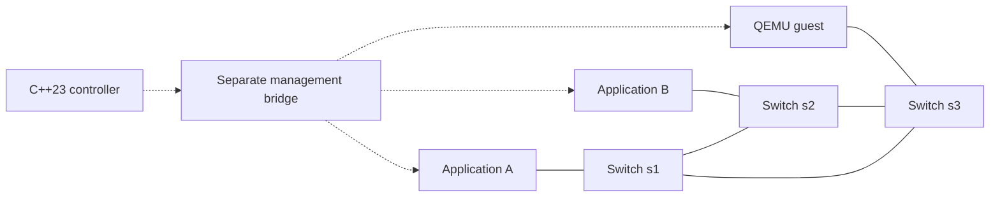
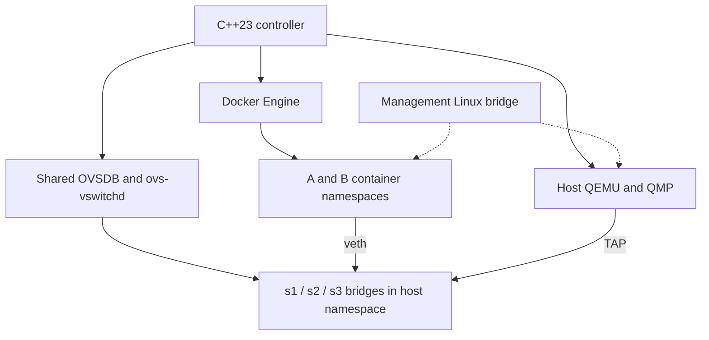
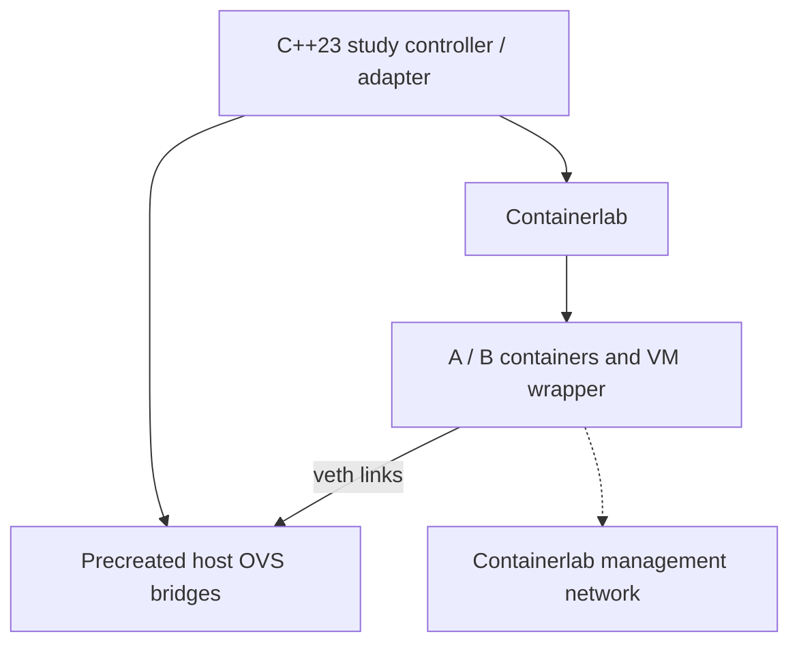
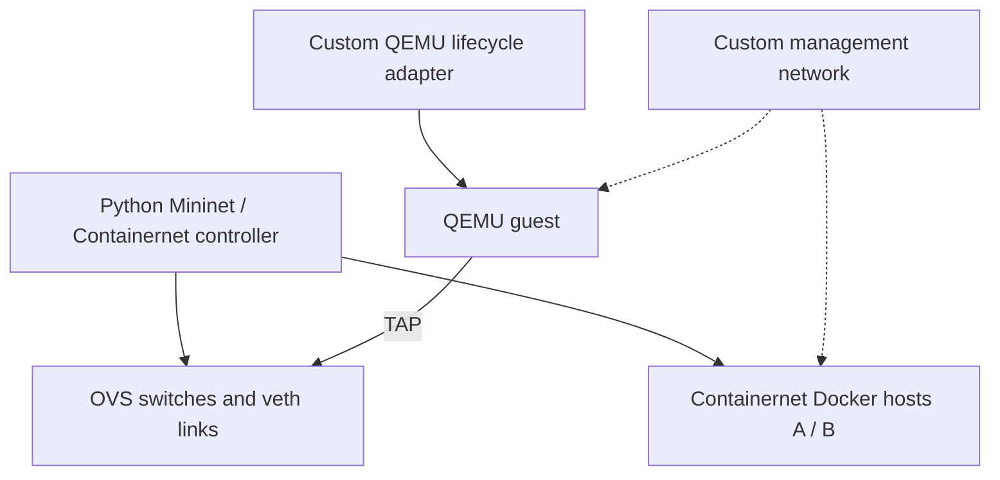
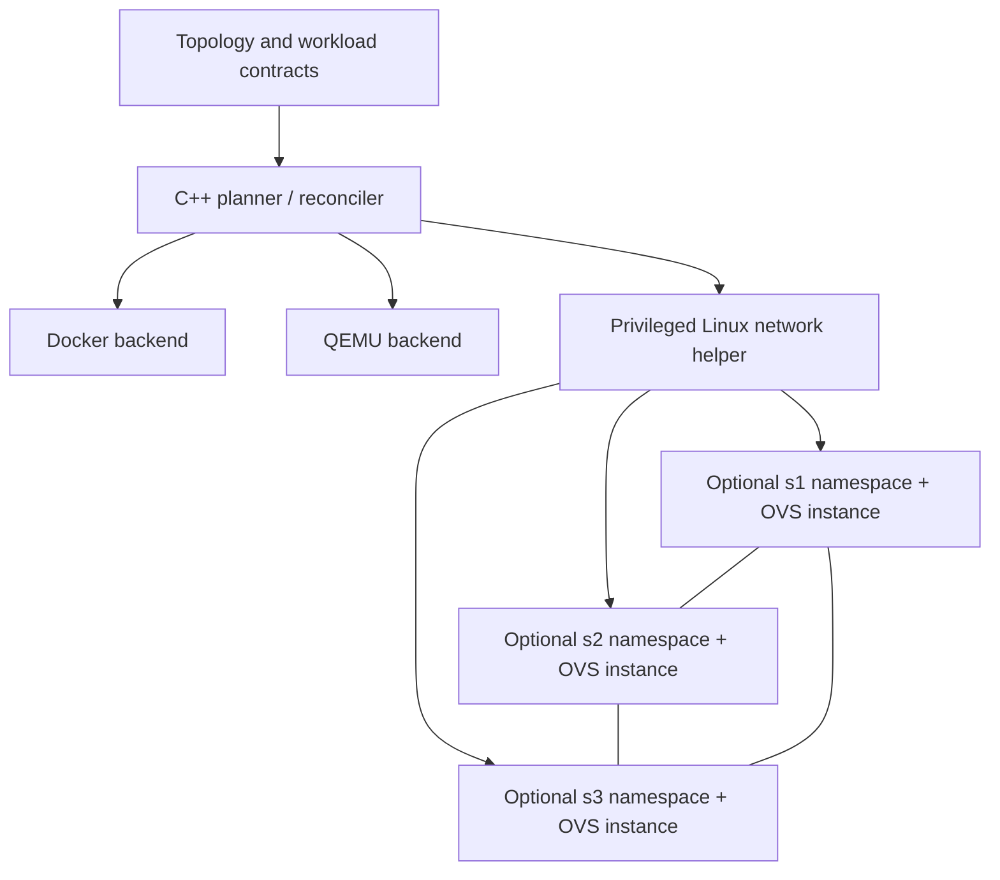
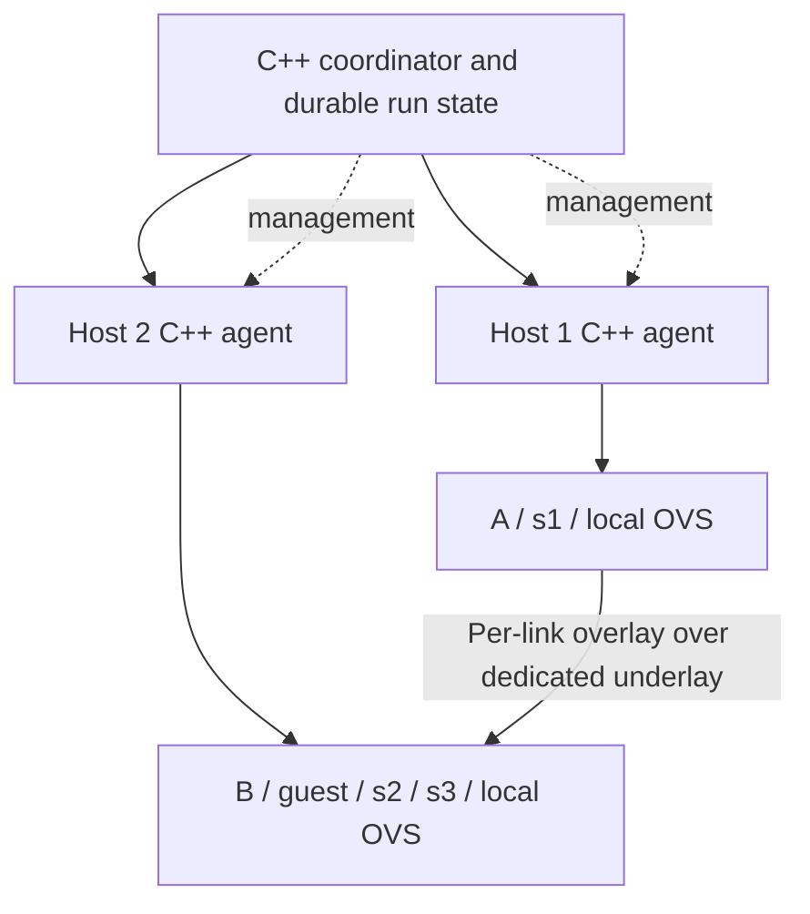

# Docker, QEMU, OVS, and C++23 architecture study

Prepared 2026-09-21 in response to [STUDY.md](../STUDY.md).

This is a design study, not an implementation or a lab test report. The available workspace contained only the study brief; the C++ files mentioned in the IDE context were not available for review. Examples below describe proposed interfaces and schemas. No containers, VMs, network devices, or production code were created.

## 1. Recommendation and assumptions

Start with a dedicated Linux host, Docker Engine, host-managed OVS, and a small declarative C++23 controller. Represent each simulated physical switch as one OVS bridge in a shared OVS instance. Connect containers with veth pairs and host-run QEMU guests with TAP devices. Use veth pairs between switches so each link has identifiable endpoints for capture and impairment. Put management on a separate Linux bridge/Docker network. Build all custom support inside Docker nodes in C++23, consuming independently versioned common support libraries.

This combines the placement simplicity of option A with the declarative lifecycle model of option D below. Do not start with per-switch OVS containers or a cluster. Add stronger switch isolation if experiments actually require independent daemon failures. Prefer host-run QEMU initially; introduce a C++23 QEMU container wrapper when image packaging makes it worthwhile.

The recommendation is an architectural judgment based on the requirements and documented interfaces, not a measured performance ranking.

| Unanswered requirement | Working assumption | Consequence if false |
|---|---|---|
| Functional testing or hardware/timing research? | Functional Ethernet, application behavior, and approximate fault timing | Use hardware or a validated simulator for ASIC buffers, microbursts, or precise timing |
| Expected scale and packet rate? | Initial target: 3 switches, 2 containers, 1 guest; later measure tens of nodes | Benchmark before committing to a host size or scheduler |
| Meaning of switch failure? | Loss of all data ports is sufficient initially | Independent daemon/kernel failures require stronger isolation |
| Trust model? | Trusted workloads on a dedicated lab host | Host namespaces and Docker are insufficient boundaries for hostile tenants |
| Available execution platform? | Linux with OVS kernel datapath, cgroups, TAP, and KVM | Use a suitable remote Linux host; TCG only for functional smoke tests |
| Guest architecture and licenses? | Redistributable Linux guest matching host ISA | Validate acceleration, image access, and redistribution separately |
| Arbitrary topology semantics? | Finite Ethernet graphs, explicit ports, loops and disconnected components permitted | Wireless/shared-medium simulation needs a separate model |
| Live topology edits? | Initial create/inspect/destroy plus reversible link faults | General hot reconfiguration requires later reconciliation work |
| Management access? | Host-only access; no public node services by default | Add deliberate routing/authentication policy |
| Reproducibility? | Repeatable artifacts, configuration, and measurable distributions | Bit-identical packet timing is not promised |

## 2. Boundaries and fidelity

| Concept | Meaning in this design |
|---|---|
| Application container | Application plus C++23 lab support; Docker owns process/container lifecycle |
| QEMU guest | Separate guest kernel and virtual hardware; QEMU/QMP owns VM lifecycle |
| QEMU-hosting container | Packaging and resource boundary for a QEMU process; container readiness does not prove guest readiness |
| OVS infrastructure container | Packaging for OVS services; does not itself imply a separate kernel or datapath |
| Simulated physical switch | Topology identity, ports, switch policy, and failure domain selected by the experiment |
| OVS bridge | Logical forwarding/configuration object; initially one per simulated switch |
| OVS instance | Here: an ovsdb-server/database and ovs-vswitchd process with explicit sockets/state |
| Network namespace | Linux interface, addressing, and routing boundary; not independent CPU, clock, or kernel |

A single ovs-vswitchd manages multiple bridges; creating three bridges does not create three independent switch processes. OVS documents one daemon as the normal arrangement. Its exit behavior also distinguishes removing datapath state from leaving it behind. Consequently, killing a daemon is not a reliable model of instantly cutting power to one switch. [OVS daemon manual](https://www.openvswitch.org/support/dist-docs/ovs-vswitchd.8.html)

OVS provides real software forwarding, but its kernel flow cache, slow path, and buffering differ from a hardware pipeline. Several bridges can share a kernel datapath. Packet buffering also occurs in the host networking stack and drivers rather than reproducing a specific switch's buffer architecture. [OVS implementation details](https://docs.openvswitch.org/en/latest/faq/design/)

Use this lab for reachability, VLAN segregation, application recovery, packet inspection, and protocol behavior under controlled faults. Do not infer physical line rate, ASIC queue occupancy, vendor CLI behavior, exact congestion response, or hardware convergence time from it. CPU scheduling, offloads, guest scheduling, and host load affect results. Vendor NOS VMs can improve control-plane realism, but hardware-in-the-loop is needed for hardware-specific claims; discrete-event simulation may be preferable for timing research, at the cost of running fewer unmodified workloads.

Keep three responsibilities distinct: workload management creates/stops containers and guests; topology management owns ports, bridges, and links; experiment execution schedules traffic/faults and collects results. A workload image must not decide which environment switch its port joins.

## 3. Verified network capability envelope

**Native** means documented by the underlying project. **Custom** means proposed controller integration. **Unverified** means the composed behavior still needs a test on pinned versions. Native capability does not establish that an arbitrary combination works.

| Feature | Evidence and constraint | Proposed integration |
|---|---|---|
| Access VLANs and trunks | Native OVS; VLAN handling depends on the forwarding pipeline | Explicit access/trunk settings; test tagged/untagged ingress and egress |
| L2 cycles, STP/RSTP | Native protocol settings; disabled by default; bond, internal, and mirror ports do not participate | Use RSTP on ordinary inter-switch veth ports; allow explicit unprotected-loop experiments |
| Link aggregation | Native OVS bonding/LACP; not equivalent to independent parallel links | Separate bond schema and tests; no RSTP-on-bond assumption |
| Tunnels | Native OVS interface types include VXLAN/Geneve | Later backend with explicit underlay, tunnel identity, and MTU |
| SDN | Native OpenFlow | Optional controller connection over management; explicitly choose controller-loss behavior |
| Delay/loss/rate | Linux netem/traffic control, not a physical OVS propagation model | Per-direction qdisc plan; capture placement and calibration |
| Link/switch outage | Custom operation over native port controls | Distinguish carrier-down, silent loss, and all-port switch outage |

The OVS database manual establishes the STP/RSTP exclusions and tunnel configuration surface. These restrictions rule out treating every possible bond/tree/tunnel combination as supported without qualification. [OVS configuration schema](https://www.openvswitch.org/support/dist-docs/ovs-vswitchd.conf.db.5.html)

OVS access/trunk settings apply to its normal switching behavior; a custom OpenFlow pipeline must implement the intended VLAN policy. [OVS VLAN FAQ](https://docs.openvswitch.org/en/latest/faq/vlan/), [OpenFlow FAQ](https://docs.openvswitch.org/en/latest/faq/openflow/)

Bonding requires an explicit policy and compatible peer behavior; a single flow should not be assumed to consume the aggregate capacity of all members. Keep the redundant triangle example unbonded. [OVS bonding](https://docs.openvswitch.org/en/latest/topics/bonding/)

Netem supports impairment distributions and seeds, but kernel timers and packet scheduling limit precision. A seed does not make a live multi-process experiment deterministic. [iproute2 netem manual source](https://kernel.googlesource.com/pub/scm/network/iproute2/iproute2-next/+/refs/heads/main/man/man8/tc-netem.8)

## 4. Concrete topology



Each workload has one data NIC and one management NIC. All data access ports initially use VLAN 100; inter-switch links carry VLANs 100 and 200. RSTP protects the triangle. A VLAN test temporarily moves B to VLAN 200 and adds a same-VLAN peer fixture. Management remains reachable while data links fail. Switch control uses host Unix sockets; it needs no IP address on data bridges.

## 5. Architecture options

The capability envelope in section 3 and the experiment/CI requirements in sections 9–11 apply to every option. The differences below specify ownership, launch, isolation, and additional integration work for each.

### A. Single host, host-managed OVS, custom controller



**Launch the example:** preflight the host; create a dedicated Docker management network; create the three OVS bridges; start A/B in a C++ readiness gate; retrieve their namespace identities; create data veths and three inter-switch veth pairs; configure VLANs/RSTP while links are down; attach two guest TAPs to s3 and management respectively; start QEMU; enable links, await convergence and guest/application readiness, then release the workload gates.

Docker owns containers and management-network endpoints. The controller owns added data interfaces, bridge configuration, TAPs, QEMU, captures, and the resource journal. Linux namespaces isolate A/B; QEMU adds a guest kernel boundary. All switches share an OVS process and host resources. A simulated s2 outage disables its data-facing links; an OVS daemon crash is a host-wide infrastructure fault.

Docker exposes a versioned HTTP Engine API, suitable for a C++ HTTP client; its official SDKs need not determine the controller language. [Docker Engine API](https://docs.docker.com/reference/api/engine/)

**Operations:** collect per-bridge state, interface counters, Docker logs, QMP events, and PCAPs. Apply impairment to concrete veth/TAP paths. Recover through an ownership journal rather than broad OVS/network resets. Native components are established projects; the new controller and integration tests remain our maintenance responsibility. Resource contention limits timing and scale; multi-host support is custom future work. Linux integration CI is required. **Best initial fit.**

### B. Containerlab plus OVS and QEMU



Containerlab documents Linux containers, an `ovs-bridge` kind, and separate management/data wiring. OVS bridges must exist before deployment; Containerlab is not their switch-policy owner. [OVS bridge kind](https://containerlab.dev/manual/kinds/ovs-bridge/), [Linux kind](https://containerlab.dev/manual/kinds/linux/), [network model](https://containerlab.dev/manual/network/)

**Example representation:** define A and B as `linux`, s1/s2/s3 as `ovs-bridge`, and the guest as a supported VM kind or a custom C++ QEMU-wrapper `linux` container. Declare links A:eth1–s1:pA, B:eth1–s2:pB, guest-wrapper:eth1–s3:pG, and the triangle using unique host interface names. Map those logical names to run-scoped names before deployment. Containerlab YAML is an adapter output, not a second source of topology truth.

**Launch:** C++ adapter precreates/configures bridges; `containerlab deploy -t example.clab.yml` starts and wires containers; custom guest integration joins its data NIC to the wrapper's data interface; a readiness barrier precedes experiments. On teardown, destroy Containerlab-owned objects first, then controller-owned OVS objects and any residual resources verified by the journal. The command illustrates the upstream interface; no generated file exists yet.

`generic_vm` supports container-packaged VMs through vrnetlab. Vrnetlab's common runtime is Python, which conflicts with the requested C++ in-node lab support if adopted unchanged. A C++ wrapper or externally managed QEMU guest is an integration alternative, not a verified drop-in replacement. [Generic VM](https://containerlab.dev/manual/kinds/generic_vm/), [vrnetlab integration](https://containerlab.dev/manual/vrnetlab/), [vrnetlab runtime source](https://github.com/srl-labs/vrnetlab/blob/master/common/vrnetlab.py)

**Operations:** Containerlab reduces container lifecycle/wiring work and supplies inspection/capture entry points. Its netem tools document delay, jitter, and loss on container links; host OVS-to-OVS shaping still needs an explicit controller path. [Containerlab impairments](https://containerlab.dev/manual/impairments/)

Shared host OVS has the same failure coupling as A. VLAN/tree/bond policy, coordinated failures, complete crash recovery, and immutable contracts remain custom. Use a distinct management network per run and disable unintended external access. Linux/KVM and resource constraints remain. The extra adapter/tool-version boundary raises compatibility work, but this is the strongest alternative if existing Containerlab integrations outweigh the C++ wrapper effort. Multi-host extensions must be evaluated separately; do not infer them from local link support.

### C. Mininet or Containernet plus QEMU integration



Mininet supports arbitrary custom topologies and uses Python APIs, Linux namespaces, and virtual links. Containernet adds Docker hosts. Its nested-container deployment documents limitations on container resource controls. [Mininet overview](https://mininet.org/overview/), [Containernet project](https://github.com/containernet/containernet)

**Example representation and launch:** use a generic importer to create three OVS switches, two Docker hosts, their access links, and all three triangle edges from the common graph. Configure VLANs/RSTP, add a custom QEMU TAP attachment to s3, and attach separate management NICs. Start the network and VM, await readiness, then execute probes. The importer, QEMU lifecycle, management segregation, and cleanup reconciliation are custom; a stock Mininet example is not this complete lab.

Switches normally share host OVS; namespace hosts are not separate machines. Capture and link shaping fit its experimentation model, but switch-process isolation and QEMU state still need deliberate design. Teardown must account for objects created outside the framework, especially TAPs and VM processes. Namespace-only hosts are lightweight, while Docker/QEMU resource usage determines this example's capacity. Linux CI and dedicated hardware are needed for comparable timing.

**Assessment:** useful for teams with existing Mininet experiments, but poor fit for the stated language preference. Adding a C++ front end does not remove the Python runtime. Running the framework in a privileged container also does not create hardware isolation. Retain only as a comparison or compatibility backend, not the recommended core.

### D. Declarative C++ orchestrator with optional per-switch isolation



This is an orchestration model, not necessarily a different placement from A. Implement the first backend using A's shared OVS. Later, a switch-isolation backend may put each switch in its own network namespace with separate OVSDB, sockets, process supervision, state directories, and veth boundaries. OVS containers belong under infrastructure, not application `docker-nodes/`.

**Launch the example:** validate the graph, persist a resource plan, create management/workload namespaces, provision each selected switch boundary, construct the six data links, apply policies, start/attach the guest, then release readiness barriers. The same plan accepts any graph without topology-specific code.

Independent OVS processes in separate namespaces are an **unverified backend proposal**, not an upstream guarantee that arbitrary co-resident instances are safe. Prove datapath ownership and restart behavior; never let two daemons manage the same datapath. If this is unreliable, use one Linux VM per switch with OVS, or retain shared OVS and narrow the fault claim. The normal OVS daemon model remains the documented baseline.

**Operations:** best control over ownership, idempotency, and C++ reuse, but highest new code burden. Separate namespaces improve name/forwarding isolation, not kernel or clock isolation. Veth boundaries simplify per-switch captures and failures; logs and counters must be aggregated across instances. Management must remain outside each failed data path. Scale is bounded by host CPU/RAM plus per-instance overhead. Linux privileged CI must cover every isolation mode. Adopt the isolated mode only after its failure experiments pass.

### E. Multi-host agents, optionally Kubernetes



**Example representation and launch:** keep the same graph and add placement assignments: A/s1 on host 1, B/guest/s2/s3 on host 2. The s1–s2 and s1–s3 edges become distinct overlay channels; s2–s3 stays local. Agents reserve resources, report readiness, create local resources and tunnel endpoints, then the coordinator releases the experiment barrier. Allocate unique tunnel identifiers per logical edge/run, avoiding accidental merging of independent links.

Start with agents controlling Docker directly if actual Docker Engine is required. Kubernetes schedules OCI workloads through CRI; Docker-built images and Docker Engine integration are different requirements. Dockershim was removed, so Docker-specific API assumptions do not carry over to a normal cluster. [Kubernetes container runtimes](https://kubernetes.io/docs/setup/production-environment/container-runtimes/)

Using Kubernetes adds scheduler/desired-state benefits but still needs custom secondary data-plane attachment, device access for KVM, switch lifecycle, and a policy preventing automatic recovery from undoing intended faults. Neither ordinary Pod networking nor an overlay automatically represents physical switch/link semantics. A QEMU workload also needs persistent artifact handling and guest readiness beyond Pod readiness.

**Operations:** agents collect local captures/counters and timestamp commands; coordinator records requested and observed fault times. Host failure differs from one simulated switch failure. Leases, fencing, replay-safe commands, and partition recovery are custom distributed work. Underlay delay/congestion imposes a floor on emulated links; outer-interface shaping may affect multiple experiments and must be avoided or isolated. Test BPDU transport, encapsulation MTU, and logical link isolation. Shared kernel failure domains remain per host. Cluster CI requires multiple privileged Linux workers and materially more maintenance. Choose this only when measured capacity, remote placement, or multi-user scheduling justifies it.

## 6. Comparison and decision triggers

Ratings are design judgments; reproducibility assumes immutable artifacts and recorded host versions in every case.

| Option | Fidelity | Docker / QEMU integration | Reproducibility | Complexity | Isolation | Scaling | CI suitability |
|---|---|---|---|---|---|---|---|
| A: host OVS + controller | Functional L2, approximate timing | Direct Docker; custom QMP/TAP | Good with manifest/journal | Moderate custom work | Containers/guest; shared switches | One host initially | Good on dedicated Linux runner |
| B: Containerlab | Same OVS limits | Native containers; VM packaging available with language caveat | Good when adapter/tool versions pinned | Lower wiring effort, extra integration layer | Shared OVS baseline | Local first; extensions separate | Good Linux runner fit |
| C: Mininet/Containernet | Functional emulation; shared host timing | Docker through fork; custom QEMU | Good with pinned scripts/images | Mature framework, Python/QEMU burden | Namespaces/shared OVS | Host constrained | Linux; nested controls limited |
| D: declarative C++ | Same forwarding limits; selectable faults | Custom, fully controlled | Strong potential; must prove recovery | Moderate with A backend; high with isolated backend | Selectable; namespaces still share kernel | Host first, backend extensible | Strong once fault suite exists |
| E: multi-host | Adds underlay/timing uncertainty | Agents direct; Kubernetes needs adapters | More infrastructure to pin | Highest | Host/VM boundaries available | Horizontal capacity | Expensive multi-worker CI |

Choose B when integration with existing Containerlab labs is more valuable than eliminating adapter complexity. Choose C only when existing Python experiments are a deliberate requirement. Extend D for independent switch-control failures; use switch VMs for stronger kernel boundaries. Choose E after resource measurements show a single host is inadequate, not merely because the graph is large. If the objective changes to vendor silicon fidelity, none of these OVS placements alone satisfies it.

## 7. Repository layout and shared libraries

Proposed optional development workspace; each marked repository has an independent Git history. These directories are illustrative and have not been created by the study.

```text
workspace/
  graphlab/                         # controller repository
    CMakeLists.txt
    CMakePresets.json
    cpp/                           # controller + host helper
    include/graphlab/
    schemas/
    topologies/
    experiments/
    infra/ovs/                     # OVS packaging/service configuration
    tests/{unit,integration,fixtures}/
    docs/
    dependencies.lock
  lab-support/                     # common C++23 library repository
    CMakeLists.txt
    include/lab_support/
    cpp/
    cmake/
    tests/compatibility/
  docker-nodes/                    # application nodes only
    app-a/                         # independent workload repository
      Dockerfile
      CMakeLists.txt
      cpp/lab_adapter.cpp
      workload.yaml
      config/
      tests/
      dependencies.lock
    app-b/                         # independent workload repository; same layout
  qemu-workloads/
    guest-linux/                   # independent guest repository
      workload.yaml
      image/                       # image build recipes and guest config
      tests/
      artifacts.lock
  qemu-runners/
    cpp-runner/                    # optional independent wrapper repository
      Dockerfile
      CMakeLists.txt
      cpp/
      tests/
```

Production execution pulls artifacts from a registry/artifact store; it requires none of these sibling checkouts. Controller-owned OVS definitions are separate from application workloads. If an OVS image acquires its own release lifecycle, give it a separate infrastructure repository as well.

Proposed reusable CMake targets:

| Library | Shared behavior | Consumers |
|---|---|---|
| `LabSupport::contract` | Versioned manifest/config types, validation, serialization | Controller, A, B, QEMU wrapper |
| `LabSupport::runtime` | Readiness gate, status/errors, deadlines, lifecycle protocol | In-node C++ adapters and wrapper |
| `LabSupport::telemetry` | Structured logs, metrics labels, event timestamps | Controller and all custom support |
| `LabSupport::probe` | Optional test traffic and interface-bound measurements | C++ probe fixtures; nodes that need them |

Keep Docker socket access, privileged namespace manipulation, and OVS control out of node libraries. All custom in-node lab agents, health commands, config adapters, telemetry hooks, and QEMU wrapper support are C++23. The application itself may use any language. A node must be usable through its contract without embedding controller code.

Publish a versioned CMake package/source archive with checksum and exported targets. A and B independently pin the same initial release (illustratively `1.0.0`), use `find_package(LabSupport 1.0.0 EXACT CONFIG REQUIRED)`, and link only their required targets. Use static project libraries initially to simplify image packaging; this does not require statically linking libc. Dynamic packages are valid later, but compiler/standard-library ABI and runtime dependencies must be pinned. Exported CMake targets and package configuration are supported mechanisms. [CMake importing/exporting guide](https://cmake.org/cmake/help/latest/guide/importing-exporting/index.html)

Separate source API compatibility from serialized contract compatibility. Support contract major version 1 explicitly; reject unknown major versions and required unknown features. Test compatible minor versions. Breaking C++ APIs require a major library release; do not promise cross-toolchain C++ ABI stability.

**Release workflow:** library CI builds/tests/packages → each workload updates its pinned dependency and builds an image independently → publish image digest and contract digest → environment CI tests that exact pair → update the environment lock in review. Guest releases publish a checksummed disk plus machine/firmware/config metadata. Dependency updates can be coordinated through tests without synchronizing releases or combining repositories. Preserve previous known-good lockfiles for rollback.

## 8. Illustrative topology and workload contract

This is a proposed YAML schema, not a supported upstream format. Angle-bracket digest placeholders must be resolved to real immutable references before validation or execution. No example registry artifacts are claimed to exist.

```yaml
apiVersion: graphlab/v1
name: redundant-three-switch
backend: linux-host
switchIsolation: shared-ovs
seed: 42
management:
  driver: docker-bridge
  subnet: 172.30.80.0/24
  dynamicPool: 172.30.80.128/25
  gateway: 172.30.80.1
  externalAccess: false
  forwardingToData: false
artifacts:
  appA:
    image: registry.example/app-a@sha256:<image-a-digest>
    contract: https://artifacts.example/app-a/workload.yaml
    contractSha256: <contract-a-digest>
  appB:
    image: registry.example/app-b@sha256:<image-b-digest>
    contract: https://artifacts.example/app-b/workload.yaml
    contractSha256: <contract-b-digest>
  guest:
    disk: https://artifacts.example/guest-linux/root.qcow2
    diskSha256: <disk-digest>
    contract: https://artifacts.example/guest-linux/workload.yaml
    contractSha256: <guest-contract-digest>
switches:
  s1:
    rstp: {enabled: true, priority: 4096}
    ports:
      app: {mode: access, vlan: 100}
      to2: {mode: trunk, vlans: [100, 200]}
      to3: {mode: trunk, vlans: [100, 200]}
  s2:
    rstp: {enabled: true, priority: 8192}
    ports:
      app: {mode: access, vlan: 100}
      to1: {mode: trunk, vlans: [100, 200]}
      to3: {mode: trunk, vlans: [100, 200]}
  s3:
    rstp: {enabled: true, priority: 12288}
    ports:
      guest: {mode: access, vlan: 100}
      to1: {mode: trunk, vlans: [100, 200]}
      to2: {mode: trunk, vlans: [100, 200]}
workloads:
  a:
    kind: docker
    artifact: appA
    management: {port: mgmt0, ipv4: 172.30.80.11/24}
    ports: {data0: {mtu: 1500, ipv4: 10.100.0.11/24}}
    resources: {cpus: 1, memoryMiB: 256}
  b:
    kind: docker
    artifact: appB
    management: {port: mgmt0, ipv4: 172.30.80.12/24}
    ports: {data0: {mtu: 1500, ipv4: 10.100.0.12/24}}
    resources: {cpus: 1, memoryMiB: 256}
  g:
    kind: qemu
    artifact: guest
    management: {port: mgmt0, ipv4: 172.30.80.13/24}
    ports: {data0: {mtu: 1500, ipv4: 10.100.0.13/24}}
    resources: {vcpus: 2, memoryMiB: 1024}
    vm: {accelerator: kvm, machine: q35, nicModel: virtio-net-pci}
links:
  - {id: a-s1, endpoints: ["a:data0", "s1:app"]}
  - {id: b-s2, endpoints: ["b:data0", "s2:app"]}
  - {id: g-s3, endpoints: ["g:data0", "s3:guest"]}
  - {id: s1-s2, endpoints: ["s1:to2", "s2:to1"]}
  - {id: s2-s3, endpoints: ["s2:to3", "s3:to2"]}
  - {id: s3-s1, endpoints: ["s3:to1", "s1:to3"]}
experiments:
  - id: redundant-path
    after: all-ready
    probe: {from: "a:data0", to: 10.100.0.12, intervalMs: 100}
    actions:
      - {atMs: 5000, link: s1-s2, operation: carrier-down}
      - {atMs: 15000, link: s1-s2, operation: restore}
```

The management addresses, including the guest's manually allocated TAP address, are reserved outside Docker's dynamic pool. Preflight rejects overlaps with existing host routes and networks. Logical `mgmt0` may map to Docker's `eth0`; data NIC names and guest NIC MACs are recorded explicitly. A backend need not rename Docker-owned interfaces to fulfill logical names. Resolve `q35` to a versioned machine type and pin QEMU/firmware in the execution lock; the convenience name alone is not a reproducibility guarantee.

**Graph rules:** node IDs are unique across switch/workload namespaces; every edge has two distinct declared endpoints; a physical port belongs to at most one edge; management ports cannot be data endpoints. Reject unresolved digests, duplicate link IDs, unsupported kinds, invalid VLANs, incompatible MTUs, and missing required workload ports. Unused optional ports and disconnected components are legal. Self-links between distinct switch ports may be represented but require the same explicit loop policy as other cycles. Multiple links between a node pair use separate ports. Bonds are a later explicit grouping of physical members, not implicit merging of parallel edges.

Accept arbitrary graph shape for supported Ethernet endpoint types. Initially implement workload–switch and switch–switch edges; direct Docker–Docker uses a veth pair. Guest–guest or Docker–guest direct edges need a transparent backend attachment segment joining TAP/veth devices, explicitly inventoried as plumbing rather than a simulated switch. Until that backend is tested, reject those endpoint combinations with a capability error, not a graph-shape restriction. No initial multi-host edges, radio links, or hyperedges are promised.

Configuration-only variants keep the workload attachments and change switch edges:

| Shape | Data configuration |
|---|---|
| Chain | Keep s1–s2 and s2–s3; remove s3–s1 |
| Ring | Keep all three edges, with RSTP enabled |
| Disconnected | Keep only s1–s2; s3 and its guest remain isolated on data, reachable on management |
| Star | Add s4, declare new ports, connect s1 to s2/s3/s4 only |
| Mesh | Declare a distinct port pair and edge for every desired switch pair |
| Parallel | Add s1:to2b–s2:to1b as another edge; RSTP handles the redundant path unless an explicit bond is requested |

Do not topologically sort the network graph: it may have cycles. Only the resource dependency plan is a DAG. Stable ID ordering makes plans comparable without depending on YAML insertion order.

Example application contract, distributed with a workload release:

```yaml
apiVersion: graphlab.workload/v1
name: app-a
kind: docker
platforms: [linux/amd64]
labSupport: {language: cpp23, package: LabSupport, version: 1.0.0}
interfaces:
  mgmt0: {role: management, required: true}
  data0: {role: data, required: true, medium: ethernet, mtuRange: [1280, 9000]}
configuration:
  mount: /run/lab/config.json
  access: read-only
  schema: config/v1
  interfaceBinding: explicit-logical-name
lifecycle:
  entrypoint: [/usr/local/bin/lab-node]
  protocol: lab-control/v1
  operations: [configure, ready, start, stop, status]
  gateUntilStart: true
  stopGraceMs: 5000
health:
  argv: [/usr/local/bin/lab-node, health]
  intervalMs: 1000
  timeoutMs: 500
resources:
  minimum: {cpus: 1, memoryMiB: 128}
  default: {cpus: 1, memoryMiB: 256}
security:
  capabilities: []
  dockerSocket: false
  writablePaths: [/run/lab, /tmp]
observability:
  logs: json-stdout
  status: management-only
```

Workload owns its command, application configuration schema, health semantics, and support implementation. Environment owns addresses, MAC assignment, logical-to-physical interface mapping, VLAN wiring, imposed resource limits, and experiment schedule. Network setup occurs through the host helper before the application gate opens. The support process reaps children and forwards termination signals if it is PID 1.

A guest contract replaces the container entrypoint with disk/firmware hashes, architecture, pinned machine type, vCPU/RAM requirements, NIC models/MAC mapping, boot timeout, guest readiness protocol, and shutdown method. A containerized QEMU contract additionally declares KVM/TUN device access, writable overlay paths, and a C++ runner. QMP-connected, guest-booted, and application-ready are separate states.

## 9. C++23 implementation blueprint

### Build and dependencies

Use CMake 3.28 or later as a proposed project baseline, Ninja, and a pinned Linux toolchain image with GCC 14/libstdc++ 14. This is a selected baseline, not a claim that older compilers cannot work. Set C++ standard 23, require it, and disable extensions. CMake supports the standard selection but can otherwise fall back unless the required setting is enabled. [CMake CXX_STANDARD](https://cmake.org/cmake/help/latest/prop_tgt/CXX_STANDARD.html)

Use `std::expected<T, Error>` for fallible operations, RAII for handles, and standard containers/chrono. GCC documents basic `std::expected` from libstdc++ 12.1 and later monadic additions; compile-probe the exact used feature set. C++23 mode does not imply every C++23 library facility is available. [GCC library status](https://gcc.gnu.org/onlinedocs/gcc-13.3.0/libstdc%2B%2B/manual/manual/status.html), [GCC 13 changes](https://gcc.gnu.org/gcc-13/changes.html)

Initially avoid standard modules, `std::print`, and stacktrace dependencies. They provide little value to the controller's first milestone. Use a separately tested Clang/standard-library pair for portable code rather than assuming Apple Clang and Linux GCC have identical support.

Proposed dependency set: yaml-cpp for configuration, nlohmann/json for wire formats, libcurl for Docker HTTP/artifact retrieval, SQLite for the durable inventory, and a C++ test framework. Pin exact source versions and hashes in the implementation phase after compatibility/license review; no dependency build has been validated in this study. Use one dependency resolution path and an offline package cache. Keep system OVS/QEMU/iproute2 packages pinned through the host image and record their actual runtime versions. Python is unnecessary for the custom runtime or common libraries.

### Modules and interfaces

| Module | Responsibility and output |
|---|---|
| `contract` / shared LabSupport | Typed workload manifests, protocol negotiation, config validation |
| `topology` | Nodes, typed ports, edges, graph validation, capability checks |
| `planner` | Deterministic resource DAG and dependency barriers; no side effects |
| `inventory` | Desired/observed state, run ownership, journal, recovery records |
| `docker` | Version-negotiated HTTP requests, labels, events, container health |
| `qemu` | Process launch, disk overlays, QMP session, guest readiness |
| `linux_network` | Privileged veth/TAP/namespace/address operations |
| `ovs` | Bridge/port transactions, policy/readiness, inspection |
| `process` | Argv-based subprocesses, bounded output, deadlines, termination/reaping |
| `experiment` | Monotonic schedule, probes, fault intent, explicit restoration |
| `observability` | Structured event stream, metrics, capture index, result manifest |

Parsing, contracts, graph/planning, and much of inventory can be tested without Linux privileges. Namespace, TAP, cgroup, and kernel OVS execution are Linux-specific. Keep privileged operations behind a narrow C++ helper with a local authenticated/permission-controlled socket; early dedicated-host prototypes may run it as root. Containers never receive the Docker control socket.

| Integration | Initial choice | Reason / future alternative |
|---|---|---|
| Docker | libcurl HTTP over local Unix socket | Typed payloads and API negotiation; CLI only for diagnosis |
| QEMU | Argv process launch + direct QMP JSON | Machine-readable events/control; avoid interactive monitor scraping |
| OVS | `ovs-vsctl` bounded transactions and structured output | Smaller initial protocol surface; direct OVSDB JSON-RPC later if justified |
| Interfaces/namespaces | Rtnetlink and namespace FDs in helper; TUN/TAP ioctl | Explicit kernel objects; isolate `setns` work from unrelated threads |
| Impairments | Controlled `tc` argv with JSON inspection where supported | Avoid implementing all qdisc netlink attributes initially |
| Capture | Bounded `tcpdump` process or libpcap adapter | Managed lifetime, filters, packet-drop accounting |

OVS's command interface supports multiple operations in one transaction, but that does not make Docker, Linux, and OVS changes one global transaction. [ovs-vsctl manual](https://www.openvswitch.org/support/dist-docs/ovs-vsctl.8.html)

QMP supplies a capability handshake, request IDs, replies, and asynchronous events. Implement event/reply separation and bounded reconnects. [QMP specification](https://www.qemu.org/docs/master/interop/qmp-spec.html)

All subprocess calls use executable plus argv, not interpolated shell strings. Validate identifiers independently of shell avoidance: OVS expressions and command options have their own syntax. Allowlist configuration fields; do not accept arbitrary command fragments from topology files. Deadlines return structured errors containing operation/resource IDs. Cancellation initiates cleanup; it does not silently drop in-flight resource ownership.

### Planning, readiness, and recovery

1. Resolve artifact hashes, contracts, backend capabilities, interface reservations, and host prerequisites before mutation. Persist the canonical topology and an immutable execution lock.
2. Allocate a run UUID and deterministic bounded-length physical names. Check collisions; a matching name without matching ownership is an error. Serialize conflicting host mutations.
3. Write operation intent before creation. Persist completion and observed identifiers afterward. Tag Docker objects, OVS rows, and link aliases with run/resource ownership where possible.
4. Create management first, then bridges, gated containers, namespace handles, data interfaces/TAPs, policies, and QEMU. Keep data links down until policies are in place.
5. Wait for OVS port creation/errors to settle, enable links, observe tree convergence, establish QMP, then verify guest and application readiness with deadlines. A running process is insufficient.
6. Start interface-bound probes and captures; record baseline; release the experiment barrier. Keep deliberate fault state distinct from accidental drift so reconciliation does not heal the test prematurely.
7. Teardown in reverse dependency order: stop probes, restore or remove owned fault state, stop workloads/VMs, close captures, detach/delete owned ports/links/TAPs, delete owned bridges, remove management endpoints/network, and audit inventory.

Hold namespace FDs and revalidate container generation/PID identity; do not trust a reused PID after a container restart. Docker does not recreate controller-injected interfaces on its own. The first version should abort/recreate the affected workload attachment rather than pretend restart is transparent.

RAII handles ordinary unwinding but not power loss or `SIGKILL`. Recovery scans durable intent plus actual objects, including resources created between intent and completion. Retry delete safely; retain actionable errors and ownership evidence when deletion fails. Never use a global network flush, delete an unowned same-name interface, or declare cleanup successful while owned resources remain. Host-wide OVSDB/QoS records and lingering namespace FDs belong in the audit. Persist results outside ephemeral runtime directories.

### QEMU networking and privileges

QEMU supports TAP-backed guest NICs and KVM acceleration; non-Linux accelerators do not turn this Linux network design into a macOS-native lab. [QEMU invocation](https://www.qemu.org/docs/master/system/qemu-manpage.html), [QEMU accelerators](https://www.qemu.org/docs/master/system/introduction.html)

For host-run QEMU, precreate data and management TAPs, attach them to the appropriate bridges, and pass authorized descriptors or owned TAP names. Disable automatic network scripts when the controller owns wiring. Use immutable base disks with per-run writable overlays, a permission-restricted QMP Unix socket, pinned firmware, and explicit MAC/NIC mappings. Validate `/dev/kvm` access and guest/host ISA compatibility; fail the requested KVM profile rather than silently benchmarking under TCG.

TAP provides Ethernet frames through `/dev/net/tun`; its lifecycle and access must be explicit. [Linux TUN/TAP documentation](https://www.kernel.org/doc/html/latest/networking/tuntap.html)

For QEMU in a container, the C++ runner creates local TAP-to-external-interface attachment bridges, separately for data and management, then owns QMP, signal handling, and guest readiness. Grant `/dev/kvm`, `/dev/net/tun`, and required network permissions only to that wrapper; validate the exact seccomp/device/capability profile. Normal applications need none of them. Device and capability grants are separate Docker controls; blanket privileged mode should not be the shipping contract. [Docker container execution](https://docs.docker.com/engine/containers/run/)

## 10. Experiments, observability, and operating limits

**Management:** create one user-defined Docker bridge per run, with guest management TAP attached through the controller. Docker bridge networking supports separate user-defined networks, but application-level data/management isolation is still our responsibility. [Docker bridge driver](https://docs.docker.com/engine/network/drivers/bridge/)

Proposed policy: no data bridge IP addresses, no host data-to-management route, no forwarding between guest/container data and management NICs, and no public port publishing. Bind application traffic/probes to data addresses; bind support endpoints to management or local control sockets. Restrict management-network access to orchestration and allowed services. Shared management can otherwise become an accidental alternate application path. For hostile workloads, choose stronger VM/host separation rather than asserting these controls form a multi-tenant security boundary.

**Directional impairments:** map each logical direction to exactly one qdisc attachment. For a switch-to-switch veth pair, apply A→B on the endpoint transmitting from A and B→A on the other. Workload and TAP paths need separate direction mapping; test it using captures and an asymmetric delay. If ingress redirection/IFB is needed, inventory and remove it too. Avoid using internal OVS patch ports for links needing ordinary Linux qdisc attachment. OVS policing drops traffic rather than buffering it like shaping; do not substitute it for a bandwidth/latency model. [OVS QoS FAQ](https://docs.openvswitch.org/en/latest/faq/qos/)

**Fault vocabulary:** carrier-down changes link state; silent-loss drops packets while preserving carrier; switch-data-outage disables all data links at one switch; daemon-crash tests OVS control failure; host-failure removes every local resource. Record both requested and observed event timestamps. Choose which semantics an experiment needs rather than labeling all of them “switch failure.”

**Results:** retain topology and contract hashes, image/disk digests, controller/library versions, host kernel/OVS/QEMU/Docker versions, CPU architecture, limits/affinity, offload settings, seed, monotonic event timeline, wall-clock correlation, pre/post link counters, per-bridge policy/tree state, logs, QMP events, and indexed PCAPs. Specify capture endpoint/direction and whether observed packets are before or after impairment. Bound capture size and report dropped capture packets. Collection overhead is itself measurable.

**Scale:** set configurable resource budgets rather than an invented maximum node count. Measure CPU saturation, memory, namespace/interface counts, FDs, packet drops, and guest boot concurrency. Run 3, 10, 30, then larger switch counts only while acceptance tolerances hold. Containers share host CPU; QEMU adds guest scheduling. Pinning CPUs and limiting background load can improve consistency, not establish hardware timing equivalence. Multi-host clocks need offset/error reporting before comparing one-way latency.

**Development/CI:** portable C++ unit tests can run on macOS/Windows. Full integration requires Linux networking privileges, OVS, Docker, and suitable KVM access. A Linux VM on a desktop may suffice if the hypervisor exposes nested virtualization and required devices; verify this rather than assuming Docker Desktop provides a controllable host OVS/KVM environment. Use a dedicated Linux CI runner for networking, KVM, and crash tests. TCG smoke tests form a separate profile with no performance claims. Reproducible host images matter as much as container digests.

## 11. Phased proof of concept and acceptance gates

Thresholds below are proposed functional test targets, not measured results or hardware promises. Record hardware/load and repeat stochastic measurements.

| Phase | Deliverable | Acceptance criteria |
|---|---|---|
| 0: contract and planner | C++23 build, shared contract package, typed graph and dry-run plan | C++ tests accept chain/star/ring/mesh/disconnected/parallel-link fixtures; reject duplicate IDs, missing endpoints, reused ports, unknown required features, and unresolved versions; graph cycles do not break planning |
| 1: Docker + shared OVS | Two independent node repositories/images, C++ in-node support, dedicated layout | Both nodes consume pinned common libraries; custom support starts/configures/reports health/stops in images without Python; same-VLAN data connectivity succeeds; management remains available with all data links down |
| 2: full example | Three bridges, two containers, one host QEMU guest | Guest QMP and application readiness pass separately; pairwise data probes succeed after readiness; PCAP contains expected traffic and no management packets on data links; captured management path has no test payload |
| 3: VLAN/tree/faults | Policy and experiment runner | VLAN 100↔200 negative probes fail while same-VLAN positive controls pass; trunk captures verify tags; triangle converges; active-link loss restores reachability through redundancy within a provisional 10 s bound; alternate-link loss does not interrupt the active path |
| 4: impairment calibration | Directional delay/loss/rate profiles and capture metadata | Isolated link: 20 ms delay in one direction raises median RTT by 20 ms ±5 ms at low load; reverse-only probe verifies direction; 1% loss over 100,000 low-rate packets falls within a stated statistical interval; 10 Mbit/s profile measures within ±10% after overhead calibration |
| 5: crash/recovery | Durable ownership journal and recovery command | Interrupt after every create/attach/start boundary and during teardown; recovery leaves no owned container, VM, veth, TAP, bridge, namespace reference, qdisc/IFB, socket, or orphan OVS row; second destroy is a no-op; unrelated sentinel objects survive |
| 6: optional expansion | C++ containerized-QEMU runner; isolated-switch/backend prototypes | Wrapper lifecycle proves guest readiness and cleanup without Python; per-switch failures do not interrupt unrelated-switch traffic; KVM/device profile validated; reject isolated OVS backend if ownership/failure independence fails |
| 7: capacity / optional multi-host | Resource envelope and distributed experiment prototype | Publish sustainable workload counts and timing distributions; underlay MTU and BPDU tests pass; coordinator/agent partition recovery proves ownership/fencing before enabling distributed production runs |

Connectivity tests bind explicitly to data interfaces to prevent a management bypass from producing a false pass. Test isolated nodes and disconnected data components positively as valid topologies. For bonds, add a separate two-switch LACP fixture without assuming RSTP participation; test member loss and multi-flow distribution. Tunnel and OpenFlow profiles need separate acceptance gates before advertising support.

The loss test should use an appropriate confidence interval (for example, a predeclared 99% binomial interval) and account for non-netem drops using counters. Timing tests require a baseline and load report. Do not loosen tolerances silently until a failing implementation passes.

## 12. Highest-risk assumptions and rejection experiments

| Risk | Small experiment | Decision |
|---|---|---|
| Shared OVS misrepresents independent switch failure | Sustain traffic on two bridges; crash daemon; compare all-port outage behavior and cached-flow survival | Name failure modes accurately; move to stronger isolation only if required |
| RSTP configuration or port type defeats redundancy | Capture BPDUs on the triangle, inspect roles, cut the active link, repeat under load | Adjust policy or reject backend/profile; do not claim hardware-equivalent convergence |
| Management masks broken data paths | Remove every data edge and run data-bound probes alongside management health checks | Data must fail while management works; fix bindings/firewall otherwise |
| QEMU readiness races or unsafe shutdown | Delay guest boot, stop during boot, kill wrapper, verify overlays/TAPs/processes | Require staged readiness and idempotent resource cleanup |
| Controller crash leaks resources | Inject interruption between every journal step and kernel/API side effect | Refine reconciliation before increasing topology size |
| Impairment bypass/double application | Send asymmetric timestamped probes and inspect both endpoints/offload settings | Fix direction mapping and publish calibration limits |
| Shared-library version skew | Build A and B separately, test same and compatible differing minor versions | Keep contract negotiation explicit; reject incompatible major versions |
| Multi-host overlay changes Ethernet behavior | Run VLAN/BPDU/MTU tests across one dedicated tunnel per edge | Disable unsupported combinations or retain local placement |
| CPU saturation looks like network loss | Sweep packet rate and guest load while collecting scheduling/drop counters | Define supported operating envelope; scale only after attribution |

## 13. Python dependency inventory and evidence limits

| Component | Python role | Decision |
|---|---|---|
| Custom controller, host helper, lab-support libraries | None planned | C++23 |
| Custom Docker-node agents/health/config/experiment hooks | None permitted by this design | C++23; minimal-image acceptance test |
| Optional custom QEMU container runner | None planned | C++23, sharing appropriate support libraries |
| Mininet/Containernet | Framework/control runtime | Excluded from recommended backend |
| Vrnetlab VM integration | Python wrapper/runtime | Do not adopt unchanged under the in-node C++ requirement |
| OVS/QEMU upstream source builds or auxiliary tools | May have upstream Python build/test/tool dependencies | Consume pinned packages initially; distinguish upstream build dependencies from custom lab runtime |
| Workload applications | Workload-specific | Application language is outside the lab-support restriction |
| Documentation/test orchestration for this project | No Python required | CTest/C++ plus limited shell CI glue |

OVS's source-build instructions include Python-related requirements; eliminating custom Python is not a claim that the whole upstream supply chain contains no Python. [OVS installation requirements](https://docs.openvswitch.org/en/latest/intro/install/general/)

Sources linked at the relevant claims were consulted on 2026-09-21. Some upstream pages track development branches or “latest”; implementation must select actual release versions and recheck these claims against their installed schemas/APIs. Native feature documentation supports feasibility, while the proposed composition, C++ adapters, schemas, fault tolerances, scale, and security profile remain untested. No existing C++ implementation was inferred from the IDE tab names.
