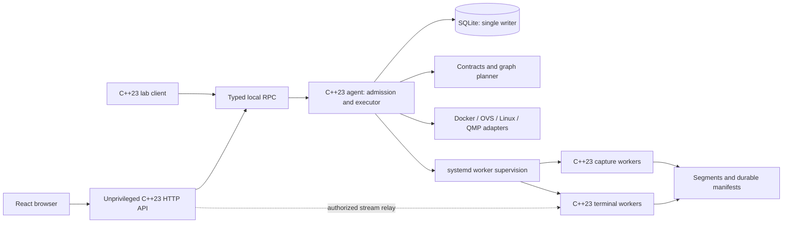
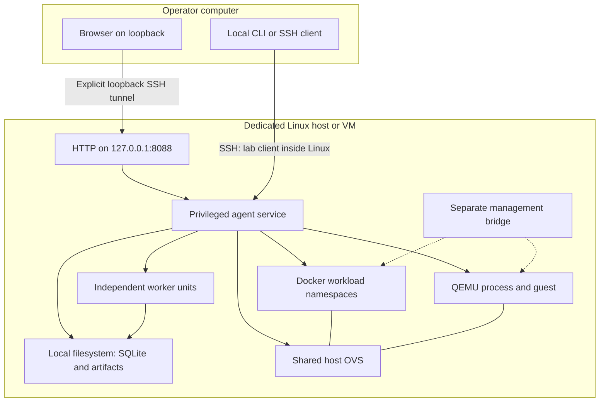

# Option D: C++23 orchestration and operational console

Design decision and implementation plan, 2026-09-21. Inputs: [STUDY.md](../STUDY.md), [architecture study](architecture-study.md), and [web-console architecture](web-console-architecture.md).

This document specifies a proposed implementation. It does not implement or deploy services. **Verified local evidence** means files inspected in this workspace; **native** means an upstream documented capability; **custom** means Graphlab code to build; **unverified** means a composition or guarantee requiring an acceptance experiment. All Graphlab contracts below are proposed, not existing interfaces.

## 1. Decision, evidence, and conflicts

Implement option D as a declarative C++23 agent with a shared-host-OVS backend, an unprivileged C++23 HTTP service, and independently supervised C++23 capture/terminal workers. CLI and browser use the same operational authority. Use React/TypeScript, React Flow, and xterm.js in the browser. Keep one agent-owned SQLite database and local artifact storage. Start with one trusted operator, one Linux host/VM, and at most one active run; arbitrary graph shape is required from the first topology contract.

### Inspected evidence

The available project contains only `STUDY.md`, `docs/architecture-study.md`, and `docs/web-console-architecture.md`. No project-specific `AGENTS.md` was found in the workspace or inspected ancestor directories. No source, schemas, tests, build configuration, runtime locks, or executable baseline is available for verification.

| Referenced item | Inspection result and implication |
|---|---|
| `cpp/topology.cpp`, other IDE C++ tabs, `docs/cpp23-status.md` | Absent here; no C++ implementation or migration progress inferred |
| `docs/cpp23-migration.md` | Absent; this request's explicit C++23 policy governs |
| `README.md`, `scripts/lab.py`, validation scripts and `docs/validation.md` | Absent; historical controller behavior and test results are unverified |
| `schemas/`, `locks/runtime.json`, `vm/graphlab.yaml` | Absent; no existing schema compatibility, image identity, patch provenance, or VM configuration established |
| Independent workload/guest repositories | Not provided in this workspace; no guest console, readiness, or shutdown implementation verified |
| ARM64 Lima, QEMU 8.2, patched Containerlab 0.79 | Historical descriptions in the console proposal, not observed running versions |

Do not overwrite or upgrade a supposedly working runtime on this evidence. If implementation later receives the real runtime/code, inventory it first, preserve measured behaviors with regression fixtures, and isolate any legacy adapter behind the same agent. There is currently no verified implementation to migrate in this checkout.

### Reconciled decisions

| Conflict or ambiguity | Decision |
|---|---|
| FastAPI and shared Python versus C++23 | All project-owned backend services, workers, custom workload executables/lab support, and backend/integration tests are C++23. Browser TypeScript and declarative/minimal bootstrap tooling are exceptions. Third-party binaries may use other languages |
| Fixed triangle versus arbitrary topologies | No fixed node/edge counts in contracts, planner, UI, captures, or tests. Triangle is one fixture |
| Containerlab baseline versus direct option D | New backend uses Docker API, Linux networking, OVS, and QMP directly. A legacy Containerlab adapter is optional only after real inspection; never run two owners over one run |
| Host QEMU versus QEMU container | Host QEMU first; containerized QEMU is a later backend using a C++23 wrapper. Both expose the same guest contract |
| Per-switch processes versus simple startup | One OVS bridge per logical switch, shared daemon initially. Isolated instances remain experimental; switch VMs are an alternative for kernel isolation |
| Browser responsiveness versus durable execution | HTTP returns durable job IDs; browser lifetime does not own execution |
| Surviving workers versus single writer | Workers own scoped I/O and append-only manifests; only agent changes desired state and writes SQLite |
| “Capture everything” versus realistic coverage | Require activation before experiment release; expose initialization exclusions, drops, gaps, and quiescence delay |
| Existing v1/v2 references | Define the proposed v2 topology below. Do not invent a migration from an unavailable legacy schema |

OVS natively manages multiple bridges in one daemon, and its shutdown semantics do not guarantee instant loss of cached kernel forwarding. A bridge, daemon, namespace, and kernel failure domain are distinct. This plan models functional Ethernet behavior, not ASIC buffering or precise physical-switch timing. [OVS daemon manual](https://www.openvswitch.org/support/dist-docs/ovs-vswitchd.8.html)

Open questions proceed with these assumptions: trusted workloads; host/guest ISA match when requesting KVM; published immutable artifacts; local Linux storage; no hot topology editing; no remote multi-user service; no packet-loss-free capture promise. Scale and monitoring overhead are measurement outputs, not assumed node-count guarantees.

## 2. Components, deployment, and authority



The stream arrow means a scoped, agent-authorized channel, not access to a general worker control socket. Service control belongs to the agent. A terminal worker may resize or write its already-authorized PTY without queuing each byte as a topology mutation.



Lima on ARM64 is a candidate deployment profile, not a verified prerequisite. Native Linux x86-64 and ARM64 are initial build targets. The same guest contract can select architecture-specific artifacts. KVM/device support must pass host preflight; unsupported acceleration fails explicitly. A TCG functional profile is separate and cannot supply comparable timing results.

| State/resource | Authority | Durable identity |
|---|---|---|
| Desired graph | Immutable topology plus workload/runtime lock | Content hash and schema version |
| Desired run/fault/job state | Agent | Run UUID, generation, revision, job UUID |
| Actual network/process state | Kernel, Docker, OVS, QEMU observations | Boot ID, namespace, ifindex, container ID, process/unit identity |
| Captures and terminal execution | Registered worker with bounded capability | Worker UUID, unit invocation, run generation, source sequence |
| Artifact bytes | Worker-owned destination under agent store | Artifact UUID, segment sequence, closed-file hash |
| Database/index/events | Agent alone | Transaction and per-run committed event sequence |
| Canvas layout | User view metadata | Topology hash plus separate layout revision |

The agent holds a host lock for its lifetime and serializes mutating plans. API/CLI/tests cannot import or bypass the executor. Cached reads remain responsive during long operations; every snapshot carries observation time/freshness. Offline maintenance requires the agent stopped, the same lock held, and registered workers reconciled. RPC failure never enables direct execution fallback.

Use independent service units for captures and terminals, outside the API/agent cgroups. Do not give them stop/restart propagation dependencies on those services. Unit supervision is native; adoption, ownership verification, and recording continuity are custom. Systemd documents cgroup tracking and dependency semantics, but exact worker unit behavior still requires restart tests. [systemd overview](https://systemd.io/), [unit manual source](https://github.com/systemd/systemd/blob/main/man/systemd.unit.xml)

## 3. C++23 modules, libraries, and layout

### Technology choices

Use CMake 3.28+ and a pinned GCC 14/libstdc++ 14 Linux toolchain as the proposed baseline. Require C++23 with extensions disabled; feature-probe `std::expected`, use RAII for descriptors/process handles, and structured cancellation/deadline types. Avoid introducing standard modules or optional library features merely because the project selects C++23. CMake supports standard selection; GCC documents feature-specific library support. [CMake standard settings](https://cmake.org/cmake/help/latest/prop_tgt/CXX_STANDARD.html), [GCC 14 library status](https://gcc.gnu.org/onlinedocs/gcc-14.3.0/libstdc%2B%2B/manual/manual/status.html)

| Concern | Selected design | Rationale, alternatives, and evidence |
|---|---|---|
| HTTP/WebSocket | Boost.Beast over Boost.Asio | Native protocol primitives; routing/auth/middleware remain custom. A higher-level framework could reduce boilerplate, but one Asio stack also supports workers and local RPC. [Beast](https://www.boost.org/doc/libs/latest/libs/beast/doc/html/index.html) |
| SSE | Custom bounded event-stream response using Beast | SSE framing/reconnection are standardized; durable replay is our database contract, not a Beast guarantee. [HTML SSE standard](https://html.spec.whatwg.org/multipage/server-sent-events.html) |
| Local RPC | Asio Unix stream sockets; length-prefixed versioned JSON | Small local protocol without gRPC/protobuf runtime/tooling; strict generated/handwritten DTO validation required. [Asio local sockets](https://www.boost.org/doc/libs/latest/doc/html/boost_asio/overview/posix/local.html) |
| Serialization | nlohmann/json; yaml-cpp at topology ingress | JSON wire/canonical typed representation; restricted YAML for authoring. Neither parser alone supplies semantic graph validation. [JSON library](https://json.nlohmann.me/), [yaml-cpp](https://github.com/jbeder/yaml-cpp) |
| Persistence | SQLite C API with C++ RAII wrapper | Short transactions; one writer; local WAL. No ORM needed initially. [SQLite WAL](https://www.sqlite.org/wal.html) |
| Docker/artifact HTTP | libcurl | Unix socket Engine access and HTTPS artifact retrieval; negotiate supported Engine API. [libcurl Unix sockets](https://curl.se/libcurl/c/CURLOPT_UNIX_SOCKET_PATH.html), [Docker API](https://docs.docker.com/reference/api/engine/) |
| Capture | libpcap C API wrapped in C++ worker; minimal PCAPNG writer | Explicit activation acknowledgement. Writer is custom and must pass format/rotation tests; libpcap activation alone is not a PCAPNG writer. [libpcap activation source](https://github.com/the-tcpdump-group/libpcap/blob/master/pcap_activate.3pcap), [PCAPNG draft](https://www.ietf.org/archive/id/draft-ietf-opsawg-pcapng-05.html) |
| Supervision | libsystemd sd-bus C API with C++ wrappers | Registered transient/template units, bounded properties and resource scopes; avoid a generic service-launch endpoint |
| UI | React/TypeScript + React Flow + xterm.js | Keep backend semantics outside widgets. [React Flow](https://reactflow.dev/learn), [xterm.js security](https://xtermjs.org/docs/guides/security/) |

Use a pinned C++ test framework with CTest; no Python backend or integration-test harness. Browser component/accessibility tests may use TypeScript. Keep subprocess adapters for `ovs-vsctl`, `tc`, SSH, and bounded diagnostics; use argv arrays, validated values, output limits, process-group ownership, timeouts, and reaping. Prefer netlink and namespace FDs for kernel operations, and direct QMP for VM control. No shell-interpolated user input.

Pin exact dependency versions/checksums in `locks/dependencies.json` during milestone M0 after Linux ARM64/x86-64 build probes. Record compiler, ABI, host kernel, OVS, Docker API, QEMU machine/firmware, tool versions and any patch hashes in `locks/runtime.json`. No version combination has been built or tested for this plan. Do not use mutable “latest” references at execution time.

### Module contracts

| Module | Boundary/output |
|---|---|
| `contracts` | Versioned typed DTOs; bounds and feature negotiation; no side effects |
| `topology` / `planner` | Valid graph → deterministic resource DAG and capture placements |
| `inventory` | Resource identity, observations, ownership comparisons, mapping epochs |
| `agent` / `jobs` | Admission, serialized executor, state machine, cancellation, recovery |
| `backends` | Docker, QEMU, Linux networking, shared/experimental isolated OVS implementations |
| `process` | Scoped execution and local privilege transitions; no generic public executor |
| `capture` | Activate, record, rotate, report coverage/stats; scoped to declared interfaces |
| `terminal` | PTY/SSH/serial transport, writer lease, output journal, replay |
| `telemetry` | Raw samples, rates, counter epochs, staleness, bounded history |
| `storage` | SQLite migrations, transactions, events, safe artifact indexing/retention |
| `api` / `cli` | Authenticated contract clients; no network-mutation implementations |

Illustrative optional development workspace; each marked repository is independently versioned:

```text
workspace/
  graphlab/                         # controller/console repository
    CMakeLists.txt
    CMakePresets.json
    cpp/{agent,api,cli,contracts,topology,planner,inventory,jobs}/
    cpp/{backends,process,capture,terminal,telemetry,storage}/
    include/graphlab/
    console/web/                    # TypeScript browser code
    schemas/{topology,workload,rpc,events,recordings}/
    topologies/
    experiments/
    deploy/systemd/
    infra/ovs/
    locks/
    tests/{unit,contracts,integration,fixtures}/
    docs/
  lab-support/                      # common C++23 package repository
    include/lab_support/
    cpp/
    cmake/
    tests/
  docker-nodes/
    app-a/                          # independent repository
      Dockerfile
      CMakeLists.txt
      cpp/
      workload.yaml
      dependencies.lock
      tests/
    app-b/                          # independent repository; same pattern
  qemu-workloads/guest-linux/        # independent disk/guest-contract repository
  qemu-runners/cpp-runner/           # optional C++ container wrapper repository
```

Publish common `LabSupport::contracts`, `::lifecycle`, `::telemetry`, and `::recording_protocol` CMake targets. Nodes depend only on applicable pieces; PTY/PCAP engines stay in Graphlab unless a real second consumer justifies extraction. Docker sockets, OVS, and privileged namespace code never enter node support. Prefer static project libraries initially, with dynamic C runtime dependencies pinned by image/toolchain. Shared reuse does not require shared-object deployment.

A and B each pin, for example, `LabSupport 1.0.0 EXACT` and a package checksum. Build/publish library → independently update/test/build each node → publish image and contract digests → integration-test selected pairs → update the environment lock. Exported CMake targets support this packaging model. C++ source API versioning and serialized protocol compatibility are separate; cross-compiler binary ABI stability is not promised. [CMake package guide](https://cmake.org/cmake/help/latest/guide/importing-exporting/index.html)

## 4. Declarative topology and workload contracts

### Versioning and canonicalization

Use `graphlab.topology/v2`, `graphlab.workload/v2`, and independent major versions for RPC/events/recordings. These are new proposed identifiers, not assertions about available schema files. Reject unsupported majors/required features. Additive optional fields must have explicit defaults; reject unknown mutation fields to catch typos. Unknown event kinds may be retained/rendered generically without granting operations. Bound YAML document size/depth; reject duplicate keys, custom tags, and aliases initially. Hash canonical typed JSON with stable key ordering and units after validation, not raw YAML formatting.

Topology contains global node IDs, typed ports, ordered edge endpoints, separate management-network attachments, switch policies, artifact-lock reference, capture policy, and resource budgets. Logical IDs are independent of ifnames and deployment order. Workload/image references must resolve to immutable digests before admission.

The following complete six-node topology is illustrative; the lock hash is an explicitly unresolved placeholder, not a runnable artifact reference:

```yaml
apiVersion: graphlab.topology/v2
id: triangle-example
artifactLock: "sha256:<resolved-artifact-lock-digest>"
backend: {kind: linux-local, switchIsolation: shared-ovs}
management:
  networks:
    mgmt:
      subnet: 172.30.80.0/24
      dynamicPool: 172.30.80.128/25
      gateway: 172.30.80.1
      externalAccess: false
nodes:
  a:
    kind: docker
    workload: app-a
    ports: {data0: {role: data, medium: ethernet, mtu: 1500}, mgmt0: {role: management}}
    addresses: {data0: 10.100.0.11/24}
  b:
    kind: docker
    workload: app-b
    ports: {data0: {role: data, medium: ethernet, mtu: 1500}, mgmt0: {role: management}}
    addresses: {data0: 10.100.0.12/24}
  g:
    kind: qemu
    workload: guest-linux
    ports: {data0: {role: data, medium: ethernet, mtu: 1500}, mgmt0: {role: management}}
    addresses: {data0: 10.100.0.13/24}
  s1:
    kind: ovs-switch
    policy: {forwarding: normal, rstp: true, priority: 4096}
    ports:
      app: {role: data, medium: ethernet, mtu: 1500, vlan: {access: 100}}
      p12: {role: data, medium: ethernet, mtu: 1500, vlan: {trunk: [100, 200]}}
      p13: {role: data, medium: ethernet, mtu: 1500, vlan: {trunk: [100, 200]}}
  s2:
    kind: ovs-switch
    policy: {forwarding: normal, rstp: true, priority: 8192}
    ports:
      app: {role: data, medium: ethernet, mtu: 1500, vlan: {access: 100}}
      p21: {role: data, medium: ethernet, mtu: 1500, vlan: {trunk: [100, 200]}}
      p23: {role: data, medium: ethernet, mtu: 1500, vlan: {trunk: [100, 200]}}
  s3:
    kind: ovs-switch
    policy: {forwarding: normal, rstp: true, priority: 12288}
    ports:
      guest: {role: data, medium: ethernet, mtu: 1500, vlan: {access: 100}}
      p31: {role: data, medium: ethernet, mtu: 1500, vlan: {trunk: [100, 200]}}
      p32: {role: data, medium: ethernet, mtu: 1500, vlan: {trunk: [100, 200]}}
edges:
  - {id: a1, endpoints: ["a:data0", "s1:app"]}
  - {id: b2, endpoints: ["b:data0", "s2:app"]}
  - {id: g3, endpoints: ["g:data0", "s3:guest"]}
  - {id: l12, endpoints: ["s1:p12", "s2:p21"]}
  - {id: l23, endpoints: ["s2:p23", "s3:p32"]}
  - {id: l31, endpoints: ["s3:p31", "s1:p13"]}
managementAttachments:
  - {endpoint: "a:mgmt0", network: mgmt, address: 172.30.80.11/24}
  - {endpoint: "b:mgmt0", network: mgmt, address: 172.30.80.12/24}
  - {endpoint: "g:mgmt0", network: mgmt, address: 172.30.80.13/24}
capture: {required: true, scope: all-data-edges, format: pcapng}
```

The artifact lock maps `app-a`, `app-b`, and `guest-linux` to contract hashes, image/disk hashes, platform, resources, guest firmware/machine configuration, and package provenance. Guest management addresses stay outside Docker's dynamic pool. Resolve QEMU aliases to a pinned machine version. Validate host subnet conflicts before resource creation.

Validation accepts cycles, isolated nodes, disconnected components, and distinct parallel edges; it rejects duplicate IDs, undeclared endpoints, reused physical ports, incompatible media/MTUs, invalid VLANs, management/data mixing, missing required workload interfaces, and unresolved artifacts. An unused optional port is legal. A switch self-link needs distinct ports and an explicit loop policy. Support multi-interface nodes without a fixed degree limit; apply configurable resource budgets instead.

| Shape | Configuration-only fixture |
|---|---|
| Chain | Remove l31 |
| Ring | Keep triangle |
| Disconnected | Remove l23 and l31; guest's data component remains valid |
| Star | Add s4/ports; use s1–s2, s1–s3, s1–s4 |
| Mesh | Declare each wanted pair with distinct ports |
| Parallel cables | Add a second s1–s2 port pair and independent edge ID |
| Multi-interface workload | Add a:data1 and its own attachment; no implicit bonding |

The planner sorts resource dependencies, not topology edges. Backend primitives: switch–switch and Docker–switch use veth, guest–switch uses TAP, Docker–Docker uses veth. Direct guest–Docker/guest–guest links need a dedicated two-port attachment bridge or equivalent scoped plumbing; inventory it separately from modeled switches and validate capture/direction semantics. Reject unimplemented endpoint pairs with a capability error until their milestone passes; do not mislabel a constrained backend as universal. Multi-host links and shared-medium hyperedges are deferred. Parallel edges are not automatically bonds.

Native OVS includes VLAN, tree, bond, and tunnel configuration, but STP/RSTP excludes certain port types including bonds/internal/mirror ports. Use ordinary veth switch links for the initial RSTP profile and separate acceptance suites for LACP, tunnels, and custom OpenFlow policy. [OVS configuration schema](https://www.openvswitch.org/support/dist-docs/ovs-vswitchd.conf.db.5.html)

### Workload contract fields

| Field | Required meaning |
|---|---|
| `apiVersion`, `id`, `platforms` | Contract major and supported OS/ISA |
| `interfaces` | Logical roles, required/optional, medium, MTU bounds, guest MAC/device mapping |
| `configuration` | Versioned application schema, read-only config destination, allowed values |
| `resources`, `security` | Minimum/default CPU/RAM, devices/capabilities, writable paths; no Docker socket |
| `lifecycle` | Prepare/configure, release, quiesce, status, stop; readiness levels and deadlines |
| `captureCompatibility` | Startup gate, boot-data behavior, bounded quiescence, whether strict profile is supported |
| `consoleCapabilities` | Explicit presets: container-shell, wrapper-shell, guest-ssh, guest-serial, logs |
| `observability` | Structured health/log protocol, management-bound endpoints |
| `labSupport` | C++23 package version/checksum and wire protocol features |

Node code owns application behavior and config/health semantics; agent owns addresses, wires, VLANs, resource limits and experiment schedules. A management address is not a substitute data path: probes and application traffic bind to data interfaces. Node support gates application processes; guest boot may need pausing separately. “Process running,” “network converged,” “guest booted,” and “application ready” are distinct states.

Guest contracts additionally include disk/firmware hashes, architecture, machine type, NIC models, guest-readiness mechanism, private QMP/serial control, and bounded shutdown. The optional container runner is C++23, receives narrowly scoped KVM/TUN permissions, and shares appropriate lifecycle libraries. QEMU natively supplies QMP and TAP/serial/paused-start mechanisms; first-byte recording and quiescence guarantees are custom validation work. [QMP specification](https://www.qemu.org/docs/master/interop/qmp-spec.html), [QEMU invocation](https://www.qemu.org/docs/master/system/qemu-manpage.html)

## 5. RPC, API, and durable state contracts

### Local transport and mutation admission

Use a 4-byte unsigned network-order length followed by UTF-8 JSON, maximum 1 MiB per control frame, with bounded nesting/collections. Bulk artifact and terminal bytes use separate scoped channels. Authenticate Unix peers and negotiate protocol major/features on connection. JSON numbers for counters, monotonic nanoseconds, revisions and sequences that can exceed JavaScript's safe integer range are decimal strings. IDs are opaque strings; generated UUIDs replace illustrative labels before runtime.

```json
{
  "protocol": "graphlab.rpc/v1",
  "requestId": "request-uuid",
  "method": "fault.apply",
  "runId": "run-uuid",
  "generation": 1,
  "expectedRevision": "17",
  "idempotencyKey": "operator-command-uuid",
  "params": {
    "edgeId": "l12",
    "direction": "endpoint0-to-endpoint1",
    "kind": "netem",
    "delayMs": 5,
    "lossPercent": 1,
    "durationMs": 60000
  }
}
```

Agent validates capability, bounds, current generation, ownership, queue/quota capacity, and revision; atomically records command/job and advances desired revision on admission. Same principal/key/payload returns the existing job; same key with different payload returns conflict. Keep idempotency records at least as long as job/run history; after expiry require a fresh key and do not claim indefinite deduplication. Single executor applies admitted transitions in order, rechecking observed identity and preconditions. Long jobs cannot block bounded read-only RPC or worker status ingestion.

HTTP maps mutations to `202 {jobId, runId, revision}`. Authentication/authorization, validation, stale revision, queue-full, and unavailable-agent errors use 401/403/422/409/429/503; no job is created for rejection. Accepted failures are job results. Errors contain stable code, safe message, retryability and IDs, not credentials or raw privileged diagnostics.

| HTTP surface under `/api/v1` | Contract |
|---|---|
| `GET capabilities`, `GET topologies` | Runtime features and immutable revision catalog |
| `POST runs`, `GET runs/{id}` | Start from locked revision/policy; desired/observed states and freshness |
| `POST runs/{id}/operations` | Typed stop/resume/recover/destroy/collect |
| `POST runs/{id}/faults`, `DELETE runs/{id}/faults/{fault}` | Directional fault apply/remove jobs |
| `POST runs/{id}/validations` | Registered C++ suite ID; scoped resources; no script paths |
| `GET jobs/{id}`, `POST jobs/{id}/cancel` | Durable progress and cooperative cancellation |
| `GET runs/{id}/events?after={seq}` | SSE replay, then live events; event ID equals durable sequence |
| `GET runs/{id}/telemetry` | Bounded time range/resolution/source filters |
| `POST runs/{id}/sessions`, `GET/DELETE sessions/{id}` | Scoped console capability and recording policy; create/close jobs |
| `WS sessions/{id}/stream` | Authorized binary stream and typed controls |
| `POST runs/{id}/captures`, `POST captures/{id}/stop` | Additional/replacement captures; coverage updated |
| `GET runs/{id}/artifacts`, `GET artifacts/{id}/download` | Registered metadata and closed-segment byte ranges |
| `PUT topologies/{hash}/layout` | Non-executable positions/view options with independent revision |

SSE `Last-Event-ID`/cursor drives replay. Subscribe from a transactionally consistent snapshot boundary and replay before delivering later live events; no replay/live race window. If history expired, require a new snapshot with an explicit boundary. Bound subscribers and detach slow clients with resumable cursors. Terminal streams are separate from events. Telemetry delivery can coalesce, but operation events remain durable. Standard SSE reconnection alone does not provide these storage guarantees. [SSE specification](https://html.spec.whatwg.org/multipage/server-sent-events.html)

### Storage and state machines

| Entity/version | Important fields/invariants |
|---|---|
| Run v1 | UUID, generation, desired revision, immutable topology/runtime/workload lock hashes, state, coverage policy |
| Resource v1 | Logical owner, backend ID, ownership marker, creation intent, observed identity, mapping epoch |
| Job/step v1 | Operation, scope, idempotency hash, admission revision, executor generation, deadline, intent/result/error, compensation |
| Event v1 | Run sequence, source identity/sequence, source time, ingest time, payload, schema major |
| Fault v1 | Edge/direction, desired policy, actual placement/readback, apply time, expiry clocks, restoration intent |
| Capture/session/artifact v1 | Contracts in sections 7–8; no binary recordings inside SQLite |

Job states: queued → running → succeeded/failed, with cancel-requested → compensating → cancelled when cleanup actually finishes. Uncertain side effects enter reconciling; inability to prove cleanup yields a failed job with residual-resource evidence. A cancellation response is not proof of rollback.

Run states: preparing → armed → converging → ready; required-capture loss leads to degraded/quiescing; stop reaches stopped; resume repeats barriers; destroy reaches destroyed only after audit. Keep desired state and observed state separate. A failed run may retain owned resources for diagnosis and cannot be mistaken for destroyed.

Journal each operation before side effects; commit verified result and corresponding events in the same SQLite transaction. External APIs and the database do not form an atomic distributed transaction; no exactly-once-effects claim. Persist deterministic ownership tags and discover objects created before completion was journaled. Never adopt by name alone; container PID reuse, ifindex reuse, namespace replacement and unit invocation changes invalidate old mappings.

Use WAL on Linux-local storage, short transactions, a bounded writer queue, explicit checkpoints, foreign keys, and a durability configuration appropriate for intent commits (initially synchronous FULL). WAL permits readers with one writer, not unlimited writers. Workers do not open the database. Use SQLite's consistent backup API plus a manifest of closed artifacts; do not copy a live main DB file alone. [SQLite WAL](https://www.sqlite.org/wal.html), [backup API](https://www.sqlite.org/backup.html)

## 6. Startup, recovery, and lifecycle walkthroughs

```mermaid
sequenceDiagram
  participant U as CLI or browser
  participant A as Agent
  participant R as Runtime adapters
  participant W as Capture and serial workers
  U->>A: Start locked topology and capture policy
  A->>A: Validate, reserve, commit job and resource plan
  A-->>U: Job ID
  A->>R: Prepare bridges, interfaces, gated workloads, paused guest
  R-->>A: Verified runtime identities
  A->>W: Register and arm captures for every data edge
  W-->>A: Activation, filter, output and mapping acknowledgements
  alt Missing or invalid acknowledgement
    A->>R: Keep release gates closed; compensate or retain failed state
  else All required captures ready
    A->>R: Enable links and await declared network convergence
    A->>W: Verify serial recording if requested
    A->>R: Continue guest and release workload gates
    R-->>A: Guest and application readiness
    A->>A: Commit ready, coverage and event boundary
  end
```

**Launch:** resolve artifact digests and contracts before mutation; acquire resource budgets; reserve short collision-checked names; create management, logical-switch bridges, stopped data links, Docker processes held at a C++ gate, and guest TAPs. Guest may start paused so QMP/serial exist while guest data traffic cannot run. Arm captures from observed mappings, not ifname guesses. Enable tree convergence before releasing experiments. QMP connected is insufficient readiness. Snapshot every default and actual runtime version. Do not require application readiness before opening a gate that its startup depends on.

**Stop/resume:** quiesce experiments through the contract, observe the result or fail with residual traffic state, then finalize experiment captures. Keep network inventory and supported management consoles. Resume creates a new capture epoch, rearms all required edges, verifies mapping/convergence, then releases traffic. A workload lacking reversible quiescence advertises restart-required; resume recreates that workload with new mappings and records the interruption.

**Fault:** admission creates durable intent; executor maps logical edge/direction to the current owned qdisc/interface; applies one typed operation, reads back, and commits observed placement and activation time. Duration starts at observed activation. Store monotonic expiry plus boot ID and UTC correlation. Recovery on the same boot preserves monotonic deadlines; after reboot, reconcile rather than compare obsolete monotonic values. If expiry is uncertain, remove the fault before admitting new traffic and record the policy. Overlapping incompatible faults on one direction conflict initially. Reconciliation respects deliberate fault intent rather than “healing” it.

```mermaid
sequenceDiagram
  participant A as Restarted agent
  participant D as SQLite and manifests
  participant W as Surviving workers
  participant R as Docker, OVS, Linux and QEMU
  A->>A: Acquire lock; close mutation admission
  A->>D: Read generations, intents and expected workers
  A->>W: Verify unit, boot and resource identities; adopt scoped workers
  W-->>A: Source journals and current stream offsets
  A->>R: Inspect uncertain side effects and fault state
  A->>D: Deduplicate journals; commit actual states and gaps
  A->>R: Restore expired faults; perform required compensation
  A->>A: Reopen admission when ownership is consistent
```

**Restart:** API restart drops client connections only. Agent restart pauses new mutations; captures/PTYs keep recording in their own units. Workers admit a new controller generation only after authenticated adoption; stale control commands are fenced. Before a new executor starts, reconcile or terminate any old bounded mutation helper still in flight. Its old process handle is not allowed to mutate a replacement resource generation. VM reboot ends live sessions/captures; mark interruption, validate partial files, and never adopt stale handles from the prior boot.

Workers journal locally with unique `(workerId, generation, sourceSeq)` keys; agent imports idempotently. Agent event sequence means commit order, not perfect cross-process occurrence order. Preserve source/ingest times. A replacement worker always gets a new capture/session generation and cannot silently fill an earlier gap.

**Destroy:** commit teardown intent; reject new operations on the run; revoke input leases; quiesce workload traffic; finalize captures and terminal recordings; close sessions; stop registered QEMU/Docker resources; remove owned ports, TAP/veth links, qdiscs/IFBs, OVS rows/bridges and management endpoints in dependency order. Audit unit/process identities, namespace FDs, files/sockets and network objects. Preserve history/artifacts under retention policy and preserve unrelated sentinel resources. Repeat destroy must be harmless. A process-name kill or global OVS flush is forbidden.

## 7. Capture contracts, guarantees, and failure policy

Required capture count is `|data edges|`, plus explicitly requested diagnostic/management captures. An isolated node needs no fictitious edge capture. Blocked RSTP links still have valid capture streams. Default placement: one verified host-side interface per inter-switch cable, host-side veth per Docker attachment, TAP per guest attachment. Internal attachment plumbing may need a backend-specific capture mapping. No capture package is required inside ordinary workload images.

An edge's ordered endpoints define direction; a capture point must describe how local RX/TX maps to those endpoints. Software captures are not guaranteed to observe delivery after a downstream netem queue. Dual-endpoint numbered probes are required before inferring loss. Record offloads and capture drops; unknown drop statistics are null, not zero. PCAPNG does not automatically guarantee reliable per-packet direction flags.

### Activation protocol

Capture worker receives a scoped resource identity, immutable policy, allocated storage budget, and output directory handle. It verifies namespace/interface identity, configures/activates libpcap, installs the filter, establishes a writable PCAPNG stream with valid headers, starts draining packets, journals its activation state, and acknowledges the agent with mapping epoch and worker identity. Activation warnings must be evaluated, not silently treated as success. Agent validates acknowledgements against the still-current graph and only then commits the armed barrier.

Libpcap natively activates capture handles; everything connecting activation, filter/output readiness, resource identity and workload release is a custom Graphlab protocol. PCAPNG writing initially implements only the required section/interface/enhanced-packet/statistics blocks, including alignment, length consistency, timestamp resolution, original/captured lengths and interface metadata. Pin the format revision and validate produced files using independent Wireshark tools and malformed-input tests. The cited format is an Internet-Draft, not a claim of a finalized RFC. [libpcap activation](https://github.com/the-tcpdump-group/libpcap/blob/master/pcap_activate.3pcap), [PCAPNG format draft](https://www.ietf.org/archive/id/draft-ietf-opsawg-pcapng-05.html)

Dumpcap is an alternative adapter with native PCAPNG/rotation support, but use it only if an explicit reliable activation acknowledgement is established for the pinned version. A startup log, delay, PID, or first file alone is insufficient. [dumpcap manual](https://www.wireshark.org/docs/man-pages/dumpcap.html)

Coverage guarantee: **no experiment traffic is intentionally released before all required captures are activated**. Record when links become enabled, network converges, guest resumes and applications release. Pre-activation interface-creation traffic is excluded unless a separate test proves coverage. The guarantee is about placement/readiness, not zero kernel drops or infinite storage durability.

### Failure, agent outage, and quiescence

Before release, any capture failure leaves gates closed. After release, failure marks coverage incomplete/degraded, stops extending release permission, and requests workload quiescence. Record failure observation time, last known healthy time, requested quiescence, and observed traffic cessation separately; the interval cannot be described as instant or lossless.

To handle capture failure while the agent is unavailable, strict-mode node support uses a bounded traffic-release lease. Initial proposed maximum lease is 10 seconds, renewed every 2 seconds only when the agent has fresh required-capture heartbeats. The C++ workload gate enforces expiry locally. The QEMU lifecycle adapter must provide an independently supervised, narrowly scoped pause/quiesce watchdog for the owned VM, including boot traffic if strict coverage is promised. It may only execute the previously registered quiescence action; it cannot admit topology changes or acquire new resources. This is delegated enforcement of agent policy, not a second desired-state writer.

If these local mechanisms cannot bound traffic cessation for a workload, reject the strict profile for that contract. Best-effort mode must be explicit and visible. The first experiment must measure the lease/watchdog behavior, guest management consequences, and actual cessation bound; 10 seconds is a proposed timeout, not a measured guarantee. QEMU pause can suspend guest SSH while serial/QMP workers remain alive. Surviving captures/terminal workers continue recording through an agent restart even if a long outage deliberately quiesces the experiment. After restart, traffic resumes only through a renewed barrier, not by reviving a stale lease.

Independent worker units need a persistent registered control endpoint/manifests that survive agent restarts. Agent adoption verifies unit invocation, boot ID, run generation, ownership nonce and mappings. Heartbeats are observations, not proof that no packets were dropped between them. During an outage workers consume only preallocated quota; they cannot independently expand their storage budget.

### Capture/artifact records

| Versioned record | Required fields |
|---|---|
| Capture v1 | ID, run/generation, edge/scope, capture epoch, canonical endpoint, mapping epoch, namespace identity, ifindex, worker/unit identity |
| Policy v1 | Required/best-effort, filter, snap length, format, rotation, byte budget, free-space reserve, offloads/profile |
| Readiness v1 | Activation/filter/output states, acknowledgement source sequence, timestamps, warnings, installed tool/library versions |
| Coverage interval v1 | Start/end, armed/released/degraded/closed state, reason, clock basis, uncertainty bounds |
| Segment manifest v1 | Artifact ID, capture/segment sequence, relative storage key, opened/closed/partial status, packet stats and their source, bytes, checksum after close |
| Artifact v1 | Owner run/session/capture, media type, interval, hash/size, retention/pin, completeness, authorization scope |

Proposed tunable defaults: full packets for supported MTU, rotate at 64 MiB or 60 seconds, 6 GiB per-run budget, 8 GiB total capture budget, 5 GiB filesystem reserve. Preflight rejects a host that cannot satisfy reservations. Split the run budget into worker allocations whose sum fits the admitted total; include manifests, temporary segments, console recordings and safety headroom in the global accounting. Agent can rebalance allocations while online. Node count and expected traffic must influence admission; a fixed budget is not a fixed-duration recording promise.

Rotate without silent overwrite. Ring eviction is a separately selected policy that records removed segment IDs/time ranges. Seven-day completed-artifact retention is subject to quota; pins consume capacity. Reserve space for journals/cleanup even when packet budget is exhausted. Workers finalize and report quota failure; they cannot overwrite an active segment to keep the UI green.

Segments are append-only while open. On close, flush/sync, checksum, finalize by atomic rename, and persist a manifest; directory durability and crash windows need tests. Recovery validates partial blocks and preserves raw interrupted bytes, distinguishing repaired exports from originals. Default active flush interval is a recorded tunable (initial proposal: one second); bytes not yet durably flushed may be lost on host failure. Do not label an open file complete. Downloads use closed segments, a requested rotation boundary, or an explicit partial export.

## 8. Terminal and recording contracts

| Capability | Target and authorization |
|---|---|
| Container shell | New Docker exec PTY in one workload; not application stdin |
| Wrapper shell | Explicitly separate capability in a QEMU-hosting container |
| Guest SSH | Owned guest endpoint/key and pinned known-host identity; allocate TTY |
| Guest serial | Persistent private UART socket broker; available independently of guest networking |
| Logs | Read-only source stream, not an interactive terminal |
| OVS diagnostics | Typed bridge/port/VLAN/RSTP/flow inspection; no host or fictitious switch shell |

Agent creates an authorized Docker exec session and hands the scoped stream to a worker; do not grant the worker an unrestricted Docker socket just to resize a PTY. Resize requests use an agent-authorized adapter scoped to that exec ID. Guest SSH workers receive only the required guest connection capability. During agent outages output drains continuously; operations requiring fresh authorization, such as new sessions or certain resize commands, wait or fail clearly.

Session v1 fields: ID, run/generation, node/capability, target identity, worker identity, recording policy, owner/viewer authorization, writer lease/expiry, output byte offset, journal sequence, terminal dimensions, created/last-active times, idle policy and state. Recordings use a versioned binary record envelope: record type, length, sequence, monotonic time, payload. Output bytes are opaque; resize, lifecycle and gap records are separate types. Preserve a wall-clock anchor and boot ID.

WebSocket subprotocol `graphlab.terminal.v1`: binary messages carry sequenced output/input data; JSON controls carry replay offsets, acknowledged offsets, resize, lease acquire/renew/release, and status. Specify maximum frame length (initially 64 KiB), bounded viewer queue (initially 1 MiB), and input rate limits. Workers spool independently of browser consumers. On viewer overflow, detach with a resumable offset; do not block the PTY. Disk/recording quota exhaustion visibly blocks further input and closes/quiesces the session according to its policy; recording cannot remain silently complete while output is discarded.

Exactly one writer lease per session is enforced by the terminal worker under an agent-issued session capability. Initial lease TTL: 15 seconds, renewal every 5 seconds. Disconnect cannot transfer ownership until expiry/release; explicit takeover revokes the old token. Capabilities bind user/session/generation/rights and expire; API cannot mint them. Existing authorized streams may continue for their bounded capability lifetime during an agent outage; new grants are denied. Logout/expiry revokes online grants and is bounded by capability expiry when control is unavailable. Test the bound explicitly.

Output recording is default. Exact input bytes are not recorded unless opted in before session creation and continuously indicated. Audit input activity without retaining bytes in default mode. Output may echo secrets; neither echo-state guessing nor default output recording is a secret-redaction guarantee. Restrictive permissions, quotas, retention, and authorized exports apply to both. A recording pause inserts an explicit gap and changes completeness metadata.

**Reconnect walkthrough:** browser loses connection; worker retains PTY and journal; writer lease expires; browser reauthenticates and sends last acknowledged output offset; agent authorizes session generation; worker replays retained bytes and resize events before live output. If offset predates retention, return a visible gap plus available boundary. Recording continuity is not a promise to reconstruct a terminal's entire historical screen after earlier data is deleted. Session expiry/explicit close/run destroy terminates the precise owned exec/SSH/PTY process; default idle shell lifetime is 30 minutes, serial lifetime is the run.

For first-byte serial recording, launch QEMU paused with a private serial socket, attach the broker, acknowledge recording readiness, then continue via QMP. Validate the actual machine/device/firmware and pinned QEMU version: paused startup does not by itself prove all device initialization output was captured. Keep QMP entirely private. If the experiment fails, advertise serial recording from attachment time instead of first byte.

Terminal data must not be inserted as HTML. Disable or restrict browser clipboard, link and control features that cross the UI trust boundary. Keep terminal-originated data separate from application commands. xterm.js explicitly treats the surrounding application as responsible for secure integration. [xterm.js security guidance](https://xtermjs.org/docs/guides/security/)

## 9. Telemetry and operational UI

Collect link counters through rtnetlink, with namespace identity; batch reads. Linux documents `rtnl_link_stats64` and multiple retrieval methods. [Linux interface statistics](https://docs.kernel.org/networking/statistics.html)

Telemetry v1: run/generation, edge/endpoint, mapping epoch, counter epoch, source kind, boot ID, monotonic nanoseconds, wall time, raw byte/packet/error/drop counters, derived rates, validity and stale reason. Compute `8 * delta(bytes) / delta(monotonic seconds)` and packet rates only within one valid epoch. Counter decrease, mapping/boot change, collector reset or invalid sample interval starts a new epoch; first rate is unknown. Use one canonical endpoint per edge and publish tested RX/TX direction mapping. Never add both ends' counters as if they measured different traffic.

Initial sampling: interface/qdisc every second, OVS/tree state every two seconds, health every five seconds. Three missed intervals means stale and a chart gap. Keep admin-up, carrier-up, RSTP state/role, health and lifecycle separate. Error/drop counters remain labeled by source; do not sum overlapping fields or call software-interface byte rate physical-wire utilization.

Retention defaults: one-second data for one hour, ten-second summaries for 24 hours, minute summaries for seven days; include gaps/counts in aggregates. Bound API ranges and point counts. Record poll/capture overhead alongside the experiment; offer an explicit reduced-observation profile. Workers preserve raw source timestamps when late records are ingested, and timeline UI exposes clock/gap uncertainty.

The browser joins immutable logical graph IDs with current inventory mappings, never attempts to reconstruct topology solely from Docker or Containerlab output. Show all data edges, even idle/disconnected/blocked ones. Canvas management is a separate toggle/layer; layout edits only change view metadata. Show shared OVS failure domains and logical-switch outage versus daemon outage distinctly.

Required initial screens:

- Graph and node/edge inspector: directional rates, mapping freshness, interface roles, VLANs, RSTP, capture coverage, fault direction/placement preview.
- Run/jobs view: desired versus observed state, queued versus applied operation times, cancellation progress and residual-resource errors.
- Timeline: linked operation, fault, health, capture and console tracks with visible gaps.
- Console tabs: explicit capability, writer/viewer status, recording policy, replay/reconnect and close.
- Artifact browser: owner/time/type filters, partial/complete status, segment checksums, retention/pin and authorized downloads.

React Flow supplies graph interaction, not runtime semantics. Use labels/patterns as well as color for state, keyboard navigation and accessible forms. Keep topology authoring, collaborative editing, multiple active labs, packet decoding and multi-user administration out of the initial release. They are separate later gates, not prerequisites for arbitrary graph viewing/execution. [React Flow documentation](https://reactflow.dev/learn)

## 10. Security and operational boundaries

HTTP user has no Docker group membership, privileged sockets, unit-control authority, or write access to agent binaries/config. Bind HTTP to VM loopback; operator tunnel binds host loopback only. Keep assets/APIs same-origin. Remote/LAN deployment requires a separate TLS/auth policy; local SSH-forwarded HTTP is the initial profile.

Require login on localhost. Provision a random operator credential locally; store its verifier using an established cryptographic library, not a custom hash scheme. Exchange for short-lived server-side sessions with HttpOnly/SameSite cookies; set Secure when HTTPS is in use. CSRF tokens protect mutations; strict Host/Origin checks cover HTTP and WebSocket upgrades. Revalidate stream authorizations on expiry; no credentials in URLs/logs. Libraries provide transport primitives, not these application policies.

Unix RPC restricts filesystem access and checks peer credentials; agent accepts only allowlisted logical operations and validates all values independently of API. API compromise can still request allowed powerful operations, so this is a trusted-operator lab, not a hostile-tenant sandbox. Workers drop capabilities after opening scoped resources where possible and cannot create arbitrary new capture targets or host shells.

Artifact requests use opaque IDs. Agent resolves registered relative storage keys using a directory FD with no symlink/traversal escape, opens a scoped read-only handle or bounded stream, and verifies authorization; API cannot choose a host path. Keep guest SSH keys, QMP, Docker and OVS sockets out of browser responses. Closed-file checksum verification and strict maximum exports protect correctness; unprivileged, resource-limited decoding is a later feature outside capture hot paths.

Data bridges have no host IPs. Management/data forwarding is disabled and tested in host, containers and guests. Guest/static management addresses are reserved outside dynamic allocation. Support services bind only to management/local control; applications/probes bind to declared data interfaces. Apply narrowly scoped firewall policy without rewriting unrelated host rules. Switch/node namespace isolation is not independent kernel or clock isolation.

Runtime data: `/var/lib/graphlab/` for agent DB and artifact roots; `/run/graphlab/` for private sockets/ephemeral control. Use Linux-local storage, not an untested shared macOS mount for database/recordings. Preserve provenance and partial artifacts over restart. Restrict logs and strip secrets from public errors. No automatic deployment or host upgrades are authorized by this design document.

## 11. Milestones and acceptance gates

Every milestone produces a usable, bounded result. Backend/unit/integration tests are C++23; browser tests may be TypeScript. Actual privileged/KVM tests require the provided Linux runner and pinned images; macOS-only checks do not qualify them.

| Milestone | Deliverable | Exit evidence |
|---|---|---|
| M0: evidence and contracts | Runtime preflight report, pinned C++ build, common package, graph validator/dry-run planner | ARM64/x86-64 build probes; all graph fixtures valid; malformed graphs rejected; no mutation during plan; record all missing runtime evidence |
| M1: read-only console | C++ API/agent read surface, logical/runtime inventory, React graph, diagnostics | Variable-sized graphs incl. disconnected/parallel edges displayed; missing runtime mappings marked unknown; shared OVS domain visible; auth/Origin/peer checks pass |
| M2: one executor | Durable jobs/SQLite, agent-only CLI, Docker/shared OVS backend, gated C++ nodes | Concurrent UI/CLI mutations serialize/conflict; idempotent retries; lifecycle/connectivity/VLAN/tree tests; interrupt every side-effect boundary; sentinel resources preserved |
| M3: capture-first runs | C++ capture workers, PCAPNG/manifests, release barrier, artifact UI | Per-edge activation verified; fail-start holds gates; rotation/quotas/drop reporting and worker adoption pass; strict quiescence/lease tests pass before strict mode enabled |
| M4: QEMU and recorded consoles | Host QEMU backend, PTY/SSH/serial workers, replay/leases | Guest readiness separate from process readiness; private QMP; PTY resize/reconnect; serial early-byte claim either proven or explicitly unavailable; cleanup across boot/shutdown failures |
| M5: telemetry and fault operations | Directional counters/charts, typed faults/expiry, correlated timeline | Known traffic validates direction/no double counting; epoch reset yields gap not spike; asymmetric netem placement proven; expiry/restart and cancellation verified |
| M6: full operational qualification | Integration matrix, compatibility/recovery evidence and measured capacity | All required tests below pass on selected Linux/ISA runtime; monitoring overhead published; exact runtime lock and independent workload artifacts retained |
| M7: optional backends | C++ QEMU container wrapper, direct guest edge plumbing, experimental switch isolation | Capability-specific tests before exposure; no regression to shared backend; namespace/datapath ownership proven or backend rejected |

M2 is a gated development capability: runs without the M3 recording barrier cannot advertise required-capture coverage. Generic topology support starts at M0 and persists through all milestones. New endpoint backends may be added later, but new graph shapes must not require new orchestration algorithms. If real legacy code is supplied, do not temporarily allow a mutating direct CLI and mutating agent to coexist; switch ownership atomically or keep the new service read-only.

### Acceptance matrix

| ID | Test fixture/action | Required outcome |
|---|---|---|
| T01 | Chain, star, ring, mesh, disconnected, isolated node, parallel links, multi-NIC workload | Parser/planner/UI accept all; edge and capture counts derived from graph; deterministic plan under input reordering |
| T02 | Duplicate ID/key, missing endpoint, reused port, invalid VLAN/MTU, unknown required feature, unresolved digest | Rejected before side effects with precise logical error |
| T03 | Same-VLAN positive control, cross-VLAN negative control, trunk tagged capture, redundant triangle | Expected reachability/isolation; RSTP roles observable; no management bypass; failover interval measured against declared target |
| T04 | Numbered sender releases immediately after barrier on every topology shape | Every required worker acknowledges activation first; earliest released packets captured at declared points; failed arm leaves all release gates closed |
| T05 | Asymmetric delay/loss, dual-endpoint numbered packets, varied offloads | Direction/hook semantics documented; no false delivered-loss inference from one PCAP; capture drops separate from qdisc drops |
| T06 | Kill capture worker, deny writes, exhaust quotas, rotate under load | Visible coverage gap; valid closed/marked partial files; bounded measured quiescence; no silent overwrite; journal space remains |
| T07 | Restart API, then agent during capture and terminal output | Workers retain identities and output; bounded authority/auth policies enforced; adoption/import deduplicates; no false continuity across actual worker failure |
| T08 | Reboot VM during active run | Old handles rejected, sessions interrupted, incomplete files indexed; restart is a new runtime/capture generation |
| T09 | Submit duplicate/different-key requests, concurrent CLI/UI faults, stale revisions | Same admitted request returns same job; mismatched key payload/stale revision conflicts; only agent mutates |
| T10 | Kill executor after intent, after create, after readback, before completion; cancel during teardown | Uncertain effects inspected; residuals reported; retry cleanup harmless; unrelated objects survive |
| T11 | One-way traffic, interface recreation, counter reset, collector outage | Correct direction, no endpoint sum, new counter epoch, unknown first sample, stale chart gaps |
| T12 | Two terminal writers; disconnect/reconnect; slow viewer; resize; no-input-recording and opt-in modes | One writer, exact replay offsets, resize events retained, bounded queues, default input bytes absent, recording gaps explicit |
| T13 | Guest paused start, delayed boot, serial broker armed before continue | Earliest claimed serial bytes actually present; SSH and QMP readiness distinct; unsupported guarantees disabled |
| T14 | Unauthenticated/hostile Origin/CSRF requests, artifact traversal/symlink, malformed RPC, oversized messages, terminal escapes | Denied/bounded; no unauthorized FD/path/host access or HTML injection; errors contain no secrets |
| T15 | Required capture fails during agent outage; release lease expires | Scoped node/VM enforcement stops experiment within measured bound; captures/recordings persist; no autonomous topology owner appears |
| T16 | Expired fault during restart; old helper/worker command against recreated run | Remove expired policy before release; generation fencing prevents stale mutations |
| T17 | Destroy repeated after every partial start phase | No owned containers, QEMU, worker units, exec sessions/PTYs, veth/TAP/IFB/qdiscs, namespace handles, sockets or orphan OVS records; retained artifacts intentional |
| T18 | Baseline vs telemetry-only vs all-edge capture under representative load | Publish CPU/RAM/I/O, latency/throughput deltas, capture loss, storage rate and sustainable resource envelope |
| T19 | Independently build app-a/app-b from pinned common packages, compatible protocol minors, incompatible major | No sibling-source checkout required; compatible releases interoperate; unsupported contract major rejected; custom support runs without Python |

Do not qualify the backend solely with internal mock method assertions. Use real kernel/Docker/OVS/QEMU observations on Linux, packet evidence, journal reconstruction, and independent PCAP readers. Unit tests cover pure planning and protocol parsing; property/fuzz tests exercise arbitrary graphs, lengths and failure interleavings. Namespace/process/KVM fixtures are capability-gated and explicitly skipped with reasons when unavailable. A skipped required integration gate is not a passed release.

## 12. Prioritized risk experiments

| Priority | Risk | Small experiment / decision |
|---|---|---|
| P0 | Missing runtime baseline hides incompatible assumptions | Obtain real code/locks and run read-only preflight first; record actual ISA, KVM, tool versions/patches. Do not claim preservation until measured |
| P0 | Activation or PCAPNG writer insufficient | Two-edge gated sender fixture; rotation/crash/readback with independent tools. Reject capture backend until activation and file validity pass |
| P0 | Capture fails while agent down and traffic continues indefinitely | Kill agent then capture worker; measure node/VM lease enforcement and management impact. Reject strict mode for non-quiesceable workloads |
| P0 | Surviving helper mutates replacement resources | Suspend a mutation helper across agent restart and generation replacement; fence/reconcile before admission. Do not rely on PID alone |
| P0 | Journal crash window leaks/adopts wrong objects | Interrupt around every intent/API/result boundary with similarly named unowned sentinels. Fix ownership/reconciliation before expanding scope |
| P1 | Worker supervision unintentionally follows agent lifecycle | Restart/stop API and agent independently while recording; inspect cgroups/unit invocation and byte journals. Adjust units; do not infer survival from process launch |
| P1 | First-byte serial claim fails for selected machine | Pause/arm/continue with known early firmware/guest marker; downgrade claim if any required bytes missing |
| P1 | qdisc/capture/offload placement misleads analysis | Bidirectional numbered probe across one impaired cable and TAP attachment; publish actual hooks/direction mapping |
| P1 | Storage accounting races among workers | Concurrent rotation at near quota/full disk; verify reservations, bounded overshoot, journal reserve and safe fail policy |
| P1 | HTTP/stream integration adds unsafe authority | Contract-level authorization tests plus parser/length fuzzing; verify compromised low-privilege API cannot open generic host resources |
| P2 | Per-switch namespaces fail independent datapath ownership | Two switch namespaces/instances, sustained unrelated traffic, targeted restarts and cleanup. Reject mode if shared impact cannot meet declared boundary; evaluate switch VMs |
| P2 | Observation overhead dominates experiments | Sweep topology size/traffic and monitoring profiles on each target ISA; publish operational envelope before scheduling larger runs |

## 13. Delivery and evidence status

This plan covers the requested architecture decision (section 1), component/authority/deployment and startup/recovery diagrams (2 and 6), C++ module/dependency/layout choices (3), versioned contracts (4–5 and 7–9), operation walkthroughs (6–8), milestones/tests (11), and risk experiments (12).

Primary documentation was consulted on 2026-09-21 and cited at the relevant capabilities. Some pages track upstream latest/master; implementation must pin released versions and rerun the compatibility gates. Library protocol support does not establish Graphlab correctness. Native OVS/Docker/QEMU/capture/service features are evidence of feasibility; shared-library packaging, worker adoption, the capture barrier, lease enforcement, protocol schemas, security controls, and recovery behavior are custom work and remain untested.

No services, lab nodes, production source files, dependency installations, or host/network modifications were made to execute this design request. The next implementation step is M0, not an unverified deployment of the complete console.
