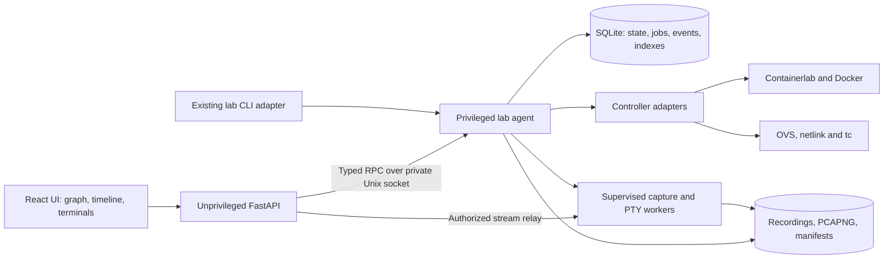
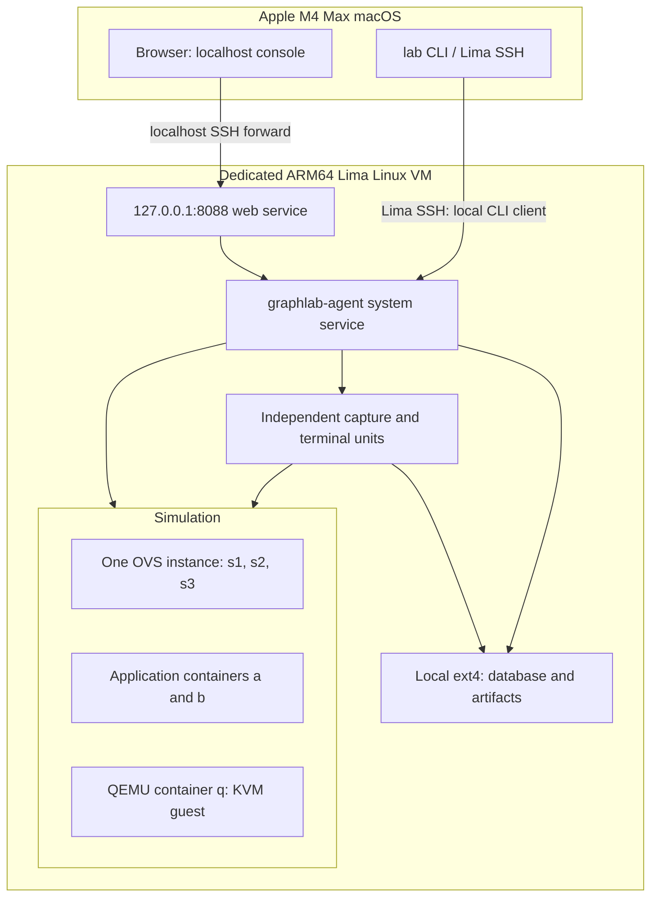

# Graphlab web console architecture

> **C++23 policy:** Project-owned executable infrastructure, workloads and tests are being converted to C++23. Earlier Python/FastAPI choices below describe the retained baseline and are superseded by the [migration contract](cpp23-migration.md). Browser TypeScript, declarative files, minimal bootstrap scripts and external tools are documented exceptions. P2 is paused pending migration verification.

Architecture proposal — 21 September 2026. This document executes [the GUI study prompt](../prompt/gui.md); it does not implement or deploy services. Graphx-docker's described experience is a requirements reference, not an inspected codebase.

## 1. Recommendation and assumptions

Use **architecture B: an unprivileged web/API service and one privileged lab agent**, with independently supervised capture and terminal workers. Keep these in the Graphlab repository, with a shared Python package and one local SQLite database owned by the agent. Use React, TypeScript, React Flow, and xterm.js in the browser. Avoid Redis, Kubernetes, distributed scheduling, and a separate database server.

The process boundary is justified now: serving HTTP should not grant direct Docker, OVS, namespace, or host-shell access. Separate workers are justified by capture and terminal continuity across API or agent restarts. They are a small set of local processes, not a fleet of services.

Assumptions:

- One trusted operator, one Linux VM, and initially one active lab. macOS on the M4 Max hosts the browser; Linux owns all simulation and recording resources.
- Topology contracts, compilation, inventory and future controller adapters must support arbitrary network configurations: variable node counts, disconnected graphs, cycles, parallel cables, multi-interface workloads and separate management networks. The triangle is a sample, not a product constraint. P1 introduces the general v2 contract; legacy deployment remains a separate restricted profile until controller generalization.
- The current triangle has six data-plane edges: three workload attachments and three inter-switch cables. Management connections are a separate, optional canvas layer and capture scope.
- Each OVS bridge models a switch, but all three share the OVS daemon and kernel datapath. The UI must expose that shared failure domain.
- Workload source repositories remain independent. Graphlab consumes versioned workload contracts and immutable image identities.
- Existing ARM64 VM and patched Containerlab remain the execution baseline. No architecture decision here implies that an unpatched upgrade is compatible.
- Begin with an operational viewer and controlled operations. Topology authoring, collaborative editing, and multi-user administration are later work.

### Alternatives

| Architecture | Concrete form | Strength | Cost / decision |
|---|---|---|---|
| A: modular backend with embedded runner | One FastAPI process with controller modules, background tasks, SQLite, and child capture/PTY processes | Few processes; fastest read-only prototype | Making this process privileged exposes too much authority to HTTP code. Its restart also threatens jobs and streams. Adding durable supervision and a privileged helper effectively becomes B. Suitable only for a disposable read-only prototype. |
| B: API plus local agent and workers | Unprivileged FastAPI; private Unix socket to agent; agent-owned database; supervised capture and PTY workers | Clear authority, common CLI/UI ownership, restart continuity | Requires an RPC contract and reconciliation. Recommended for the first operational release. |

Keep validation, topology compilation, runtime inventory, lifecycle, fault policy, capture, terminal, persistence, and API schemas separate in code immediately. Do not create separate telemetry, artifact, authentication, or scheduler services initially. Extract workers into independent packages only if maintenance or scaling requires it.

## 2. Inspected baseline and required changes

Evidence comes from [README](../README.md), [the earlier study](architecture-study.md), [validation results](validation.md), [the controller](../scripts/lab.py), the topology/workload schemas, and the lifecycle, trunk, partial-teardown, and lab test scripts. Guest details were inspected in the sibling `graphlab-workloads/guest-q` repository. The following distinguishes implemented behavior from proposals; no new runtime verification was performed for this study.

| Area | Existing implementation | Required addition/change |
|---|---|---|
| Host and VM | Lima ARM64 Linux VM; Docker, OVS, QEMU/KVM; locally patched Containerlab; source copied into VM | Install web/agent units and assets inside VM; explicit localhost tunnel; retain runtime locks and patch checks |
| Topology | Fixed three-switch, three-workload schema; controller owns inter-switch veths; Containerlab owns workload lifecycle and attachments | Compile a complete logical graph from Graphlab topology, then join runtime inventory. Containerlab's generated topology alone omits inter-switch links |
| Lifecycle | `up`, inspection, collection, recovery and teardown; ownership labels; coarse JSON phases; health gates | Durable jobs, reconciled step journal, stable run UUIDs, cancellation, and structured progress |
| Ownership lock | Nonblocking `flock` in CLI `main()` | Move exclusivity into the executor/service boundary. Direct imports of `lab.up/down` and some tests currently bypass it |
| Monitoring | Snapshot `ip`, OVS, qdisc, logs and health collection; RSTP string inspection | Continuous structured samples, endpoint identity, counter epochs, stale status and charts |
| Faults and tests | Test scripts manipulate links/qdiscs and validate VLAN/RSTP/recovery | Typed fault operations, directional placement, durable desired fault state, scheduled expiry, registered validation jobs |
| Packet capture | Tests capture selected interfaces; no automatic all-edge capture | Managed capture workers, readiness barrier, quota accounting, rotation and manifests |
| Application console | Containers run applications; startup is gated | New Docker exec PTY shell sessions. These are distinct from application process stdin |
| Guest console | `/guest-exec` uses SSH without interactive TTY flags; serial writes `/run/serial.log`; private QMP socket | Interactive SSH preset with TTY allocation; serial socket and persistent broker; independent recording before boot |
| Cleanup | Ownership-aware teardown and partial-failure coverage | Stop only registered workers, finalize artifacts, verify worker/PTY/qdisc cleanup, preserve unrelated resources |

The controller currently brings cables up during wiring, then waits for RSTP and releases `network-ready`. Split this into **prepare network → arm capture → enable forwarding → release workloads**. The existing gate is useful but does not alone prove coverage of packets emitted while Containerlab creates interfaces.

Refactor test scripts before exposing them as jobs. In particular, the current lab test starts its own capture processes and kills application-container `tcpdump` processes by name. Managed validation must use registered resources and precise process handles, so it cannot kill console-owned captures. Direct Docker restarts, bridge removals and other destructive lifecycle tests become explicitly exclusive scenarios.

Existing validation establishes a working network and recovery baseline, including repeated lifecycle tests. It does not establish GUI, durable job, streaming, recording, or all-edge capture correctness.

## 3. Components and deployment



The last arrow is conceptual: the agent authorizes a particular stream and passes a scoped channel/file descriptor or brokers it. The API never gets a generic worker control socket or direct Docker socket.



Run the API as a dedicated user without membership in the Docker group. Run the agent with the authority needed for the existing controller. Agent code and service definitions must not be writable by the API user. Workers receive only their target interface/session and artifact destination; drop privileges where supported after opening privileged resources.

Use independent systemd units for long-lived workers, with resource limits and explicit cleanup policy. They must not be configured to die automatically whenever the API or agent restarts. A VM reboot is different: live PTYs and captures end, then reconciliation marks interruptions and creates new generations if explicitly resumed.

## 4. Authority and concurrency

| State | Authority | Rules |
|---|---|---|
| Desired topology | Versioned Graphlab topology plus workload/image locks, copied into immutable run snapshot | UI layout is separate; running topology cannot change through layout edits |
| Desired operations/faults | Agent database | Revision-checked commands; explicit fault expiry and rollback intent |
| Observed runtime | Docker, Linux interfaces/namespaces, OVS and QMP, read by agent | Database is a timestamped cache, never proof that a resource still exists |
| Job state | Agent database and reconciled step journal | One mutation executor initially; browser/API lifetime does not own jobs |
| Capture/session execution | Registered supervised worker, identity checked by agent | Worker sequence journal reports progress while agent is unavailable |
| Artifact bytes | Agent-controlled local artifact store | Closed files have checksums; partial/open files are identified separately |
| Artifact index and retention | Agent database plus recoverable manifests | Index may be rebuilt; never infer run ownership from a filename alone |

Give every run an immutable UUID and generation. Human labels such as `demo` may repeat. Node and edge logical IDs remain stable within topology revisions; physical interface names, ifindices, network namespaces, container IDs and PIDs belong to a runtime generation.

Make `lab` a client of the same agent while preserving its user-facing commands. The agent holds the controller lock for its lifetime, and its executor serializes mutations. Reads use cached snapshots without blocking on long deploys. Tests and automation use the same operation contract. An explicit offline maintenance mode requires the agent stopped, its lock acquired and workers reconciled; never silently fall back to direct execution when RPC fails.

A durable job records intent before executing a step and completion after observing the result. A crash between these writes produces an uncertain step requiring inspection, not blind replay. Enforce idempotency keys and resource ownership markers; do not claim exactly-once effects across a database and Docker/OVS. Agent generation fencing and unit identities prevent an old command or worker from controlling a replacement run.

## 5. Technologies and compatibility

| Layer | Recommendation | Alternatives and maintenance |
|---|---|---|
| UI | React + TypeScript; React Flow for custom workload/switch nodes and edge overlays | Cytoscape.js warrants evaluation if graphs grow substantially. The six-edge initial canvas does not justify a specialized graph engine |
| Terminal | xterm.js, with a small authenticated stream protocol | A terminal widget is not a PTY server; maintain the broker separately |
| API | FastAPI, serving built static assets and REST/SSE/WebSockets | Go would offer a compact binary but require a second backend language beside the existing Python controller |
| Agent | Python package extracting the existing controller, typed request models, supervised subprocess adapters | Avoid building a generic remote-command framework |
| Persistence | SQLite WAL on VM-local filesystem; files for bulk recordings | PostgreSQL and a message broker add little value for one writer and one host |
| Capture | dumpcap behind a capture-worker adapter; PCAPNG default | Existing tcpdump can support a prototype. Readiness and rotation behavior must be validated for the installed version |
| Supervision | Linux service manager for agent/API and persistent workers | An embedded runner is acceptable for bounded, restartable read-only tasks only |

React Flow supplies graph interaction primitives; layout, runtime semantics and operation authorization remain Graphlab responsibilities. See the [React Flow documentation](https://reactflow.dev/learn). FastAPI supports WebSocket routes and dependencies, but its in-memory connection example is not durable job infrastructure. See [FastAPI WebSockets](https://fastapi.tiangolo.com/advanced/websockets/).

The browser assets are architecture independent. Build and test the frontend and Python dependencies on Linux ARM64, pin versions and lockfiles, and prefer available ARM64 packages/wheels. The existing Python/Linux tooling is evidence for the agent baseline, not proof of every future dependency. Test the exact QEMU 8.2 and Containerlab 0.79 patched runtime before selecting new options or upgrading. Preserve `locks/runtime.json` provenance in every run.

## 6. Network observation and capture semantics

### Counters and rates

Collect batched host-interface counters every second, qdisc statistics every second, and OVS port/RSTP state every two seconds initially. Health can use a slower five-second interval. These are proposed defaults, adjustable per experiment and recorded in its metadata.

Use Linux `rtnl_link_stats64` via rtnetlink, initially through structured `ip -j -s` output if necessary. Linux documents both the standard counters and their retrieval interfaces in [interface statistics](https://docs.kernel.org/networking/statistics.html). Namespace-specific sources must include namespace identity.

Choose a canonical endpoint per edge. For a cable oriented A→B, map canonical endpoint TX to A→B and RX to B→A, after a directional validation test. For workload attachments, the host veth TX points toward the workload; its RX comes from the workload. Do not add endpoint TX and opposite endpoint RX together: they observe the same traffic. Expose the opposite endpoint as a diagnostic comparison.

Calculate `bps = 8 × delta(bytes) / delta(monotonic_time)` and packets/s equivalently. A changed ifindex/namespace/container generation, decreasing counter, collector restart or implausible interval starts a new counter epoch. Show the first sample as unknown, never a negative rate. After three missed polling intervals, mark data stale and leave a chart gap. Store wall time for correlation and monotonic time plus VM boot ID for durations.

Show endpoint errors/drops, OVS counters and qdisc drops as separate named sources. Do not sum overlapping drop fields or equate a counter difference with network loss. These byte rates are software-interface rates, not physical-wire utilization including all Ethernet overhead. Display administrative state, carrier state and RSTP forwarding state independently; a live cable can have a discarding RSTP port.

Retain one-second samples for one hour, ten-second aggregates for 24 hours, and minute aggregates for seven days by default. Maintain a short browser history and bounded agent buffers. Record collection CPU, write throughput and capture drops alongside workload measurements. Provide a reduced-monitoring profile, with the chosen fidelity recorded in the run.

### Capture placement and readiness

Automatically create one capture per data-plane edge, including a blocked RSTP cable. Use one selected host interface on each inter-switch cable and the host-side veth of each workload attachment. This avoids requiring capture software in application images. Resolve interfaces from verified runtime mappings, not generated name guesses.

Capture files observe packets at a particular software interface hook. They are not intrinsically the packets delivered after a downstream netem queue. An outbound capture can include packets subsequently dropped or delayed; the reverse direction has different hook placement. Store the namespace, endpoint, direction interpretation and qdisc location in the manifest. Validate this placement experimentally before making loss claims. Dual-endpoint captures can compare uniquely numbered packets across a cable; capture drops, retransmissions, offloads and packet transformations must be considered. A single-endpoint capture cannot prove delivered loss.

The startup barrier must mean: interface identity verified, capture handle activated, filter installed, output writable and worker acknowledgement received for all six edges. A PID or nonempty file is insufficient. A dumpcap readiness protocol usable on the installed version is an unresolved compatibility item. Prototype it first; if it cannot provide a reliable acknowledgement, use a small libpcap-based adapter with an explicit activation acknowledgement rather than a startup sleep.

Define coverage precisely: **no workload experiment traffic is released before all captures are armed**. Hold workload gates and keep data links disabled during preparation where supported. Containerlab may create interfaces in an up state and Linux may emit control traffic before Graphlab can attach capture. Disable unwanted automatic protocol traffic or document that pre-barrier creation traffic is outside coverage. Do not claim lossless capture of every interface-creation packet. Once armed, enable links, observe RSTP convergence, release workloads, then declare experiment readiness. Guest boot data-plane traffic after release is included.

Default policy is fail closed: if capture cannot start, do not release the experiment. If a required capture later fails, mark the run degraded immediately and schedule workload quiescence through the controller; record the uncovered interval. Quiescence must not be falsely reported as instantaneous. Optional best-effort mode requires an explicit run setting and visibly weaker coverage.

### Files, limits and inspection

Use PCAPNG with one interface per edge stream initially. It supports interface metadata and multi-interface files; PCAP is a useful compatibility export for individual interfaces. Do not assume PCAPNG automatically supplies reliable packet-direction flags. Keep a sidecar manifest even when metadata is embedded. Dumpcap documents capture filters, snap length, rotation, formats and interface descriptions in its [manual](https://www.wireshark.org/docs/man-pages/dumpcap.html). Exact flags must match the VM's installed version.

Proposed defaults: no filter, full packets for the current MTU, rotation at 64 MiB or 60 seconds, a 6 GiB run budget, an 8 GiB total capture budget, and a 5 GiB VM free-space reserve. Reserve capacity at admission and monitor it during capture; these values need a disk-budget trial on the 60 GiB VM. Full-packet capture across six edges each carrying 100 Mbps in both directions can approach 150 MB/s, or 540 GB/hour before overhead. Storage policy is therefore part of experiment design.

Default retention never silently overwrites an active experiment. Exhausting its budget stops further experiment traffic as above, finalizes available files and reports incomplete coverage. An explicit ring mode may evict old segments, but records every eviction and the retained time range. Keep completed artifacts seven days subject to quota; pinned artifacts consume quota and may block new runs. Rotation alone is not retention enforcement.

Each segment records run/generation, edge, capture ID, interface mapping, capture point, filter, snap length, tool version, clock basis, start/end, packet and kernel-drop statistics when available, byte count and checksum after close. Unknown statistics remain unknown, not zero. Workers emit failures and rotation records to durable manifests. Open files are marked partial; downloads normally use closed segments or a requested rotation boundary.

Allow filters only as validated capture expressions passed as arguments, never shell text. Management capture is separately enabled, separately labeled and budgeted. Initially offer downloads for Wireshark on macOS. Later, a bounded, unprivileged decoder can read closed segments to show a small packet summary; decoding is not in the capture hot path. Avoid a custom Wireshark replacement and unbounded live packet streaming to the browser.

## 7. Consoles and recording

Expose distinct capabilities in workload contracts:

| Target | Initial console behavior |
|---|---|
| Application container | New interactive shell via Docker exec with a PTY; does not attach to the application's original stdin |
| QEMU container | Optional wrapper shell, visibly distinguished from the guest |
| QEMU guest | SSH terminal through an authorized workload adapter; modify the current helper to allocate an interactive TTY |
| QEMU serial | Persistent UART broker, available before guest networking; interactive support requires changing the workload definition |
| OVS bridge | Structured port, VLAN, RSTP and flow inspection panels, plus validated operations; no invented switch OS shell |
| Application process stdin | Unsupported unless the workload explicitly defines a safe attach contract |
| Logs | Read-only streams with source identity; not terminal sessions |

A terminal worker owns the PTY or serial connection, not the HTTP process. It continuously drains output, records it, and fans out to viewers. One session has one renewable input-writer lease and any number of authorized viewers. Disconnect releases the browser's writer lease after a short grace period but preserves the session; a reconnect can reclaim it if available. Default idle shell lifetime is 30 minutes; serial recording lasts for the run. Explicit close and run teardown terminate owned sessions predictably.

Use WebSocket binary frames for byte streams and typed control messages for resize, acknowledgements, offsets and lease changes. Bound input size and rate. Persist ordered output chunks with session sequence, monotonic timestamp, wall-clock anchor, resize and lifecycle events. Replay reconstructs terminal dimensions and timing; reconnect resumes from an acknowledged output offset. A slow viewer is detached with a resumable offset rather than blocking the PTY or dropping recorded output silently.

Record output by default. Audit that an operator sent input, but **exact input-byte recording is opt-in per session**, announced before opening it and visibly indicated throughout. It can capture passwords and pasted secrets even when the terminal does not echo them. Echo-state detection cannot reliably redact secrets. Output can also contain secrets; apply the same access and retention controls. If recording is paused, insert an explicit gap marker. Raw byte recordings may be encrypted at rest later, but an initial single-user VM must still restrict file permissions and exports. Default console retention is seven days with per-session and total quotas; reaching a recording quota visibly pauses input and offers close or an explicitly recorded policy change.

Current serial output is file-only. Change the **guest-q repository** to expose a private Unix serial socket and connect a persistent broker. Keep QMP a separate, privileged control channel. QEMU documents socket character devices and serial routing in the [QEMU manual](https://www.qemu.org/docs/master/system/qemu-manpage.html); compatibility with installed 8.2 must be checked. For first-byte boot recording, prototype launching paused, attaching and arming the broker, then continuing through QMP. Do not assume a broker attached after boot can recover already emitted bytes. Preserve a diagnostic raw serial file if useful, identifying it separately from the interactive session journal.

Treat all terminal content as untrusted. Do not insert it as HTML; restrict link handlers and disable clipboard/control features that cross the browser trust boundary unless explicitly enabled. Follow [xterm.js security guidance](https://xtermjs.org/docs/guides/security/). Terminal authorization deliberately permits shell commands inside the selected workload; it must not become arbitrary host command execution.

## 8. API and transport contracts

All mutations return `202` with a durable job ID unless they are small metadata updates. Include `Idempotency-Key` and an expected run revision on mutating requests. The agent repeats validation independently of the API.

| Endpoint | Purpose |
|---|---|
| `GET /api/v1/capabilities` | Supported operations, runtime versions, workload console capabilities |
| `GET /api/v1/topologies` | Validated topology catalog and immutable revisions |
| `POST /api/v1/runs` | Start from topology/image-lock revision and capture policy |
| `GET /api/v1/runs/{id}` | Desired state, observed snapshot, revision, coverage and freshness |
| `POST /api/v1/runs/{id}/operations` | Typed stop, resume, recover, destroy or collect operation |
| `POST /api/v1/runs/{id}/validations` | Registered suite with resource scope; no arbitrary script path |
| `POST /api/v1/runs/{id}/faults` | Link state or directional delay/loss/rate policy with optional expiry |
| `DELETE /api/v1/runs/{id}/faults/{faultId}` | Idempotent removal job |
| `GET /api/v1/jobs/{id}`; `POST .../{id}/cancel` | Progress, result, cancellation request |
| `GET /api/v1/runs/{id}/events?after={seq}` | SSE durable event replay followed by live events |
| `GET /api/v1/runs/{id}/telemetry` | Bounded range, resolution and edge selection |
| `PUT /api/v1/topologies/{revision}/layout` | Non-executable canvas layout with its own revision |
| `POST /api/v1/runs/{id}/sessions` | Authorized node and capability preset, recording policy |
| `GET /api/v1/sessions/{id}`; `DELETE .../{id}` | Session state / close job |
| `WS /api/v1/sessions/{id}/stream` | Authenticated terminal stream, output offset, writer lease |
| `POST /api/v1/runs/{id}/captures` | Additional/diagnostic capture or replacement generation |
| `POST /api/v1/captures/{id}/stop` | Explicit stop; updates run coverage |
| `GET /api/v1/runs/{id}/artifacts` | Indexed artifacts, completeness, coverage and retention |
| `GET /api/v1/artifacts/{id}/download` | Authorized immutable segment/export; bounded range support |

Example fault request:

```json
{
  "expectedRevision": 17,
  "kind": "netem",
  "edgeId": "l12",
  "direction": "s1-to-s2",
  "delayMs": 5,
  "lossPercent": 1,
  "rateMbps": 100,
  "durationSeconds": 60
}
```

Example committed event:

```json
{
  "schemaVersion": 1,
  "eventId": "evt-uuid",
  "runId": "run-uuid",
  "generation": 1,
  "seq": 183,
  "at": "2026-09-21T15:20:01.125Z",
  "type": "capture.ready",
  "jobId": "job-uuid",
  "data": {
    "edgeId": "l12",
    "captureId": "capture-uuid",
    "interface": {"namespace": "host", "ifindex": 42, "name": "g123abc12a"},
    "coverage": "armed-before-workload-release"
  }
}
```

Use `401` unauthenticated, `403` disallowed capability, `404` unknown resource, `409` stale revision/conflicting operation, `422` invalid typed values, `429` bounded queue exhausted and `503` agent unavailable. A syntactically valid request rejected for capacity can return a stable `capacity_exhausted` conflict before creating a job. Accepted jobs report subsequent failure in job state. Errors contain code, message, retryability, request/job ID and structured details without credentials or raw privileged command output.

SSE handles lifecycle/capture/fault events; telemetry may be coalesced and fetched by range. Terminal traffic uses its own WebSocket channel to prevent output bursts starving operation events. No endpoint accepts arbitrary shell strings, host paths, namespace names or interface names from the browser as authority.

## 9. Data, durability and recovery

| Entity | Principal fields |
|---|---|
| Run | UUID, label, generation, topology snapshot/hash, lock snapshot, desired/observed state, revision, coverage policy, timestamps |
| Node | Run, logical ID, kind, workload contract/image identity, health, console capabilities |
| Edge | Run, logical ID, ordered endpoints, VLAN/trunks, desired fault policy, canonical capture endpoint |
| Interface mapping | Edge endpoint, namespace identity, ifname/ifindex, container ID, OVS bridge/port, mapping epoch |
| Job and step | UUID, operation, idempotency key, scope, expected revision, executor generation, status, deadlines, result/error |
| Event | Run sequence, unique ID, source sequence, type, payload, wall time and clock identity |
| Telemetry sample | Source, mapping epoch, counter epoch, monotonic time, raw counters, derived values, validity |
| Console session | Node/capability, worker identity, input owner lease, recording policy, output offset, state, expiry |
| Capture | Edge/endpoint, mapping epoch, worker identity, filter/snaplen, readiness, coverage intervals, stats, state |
| Artifact | UUID, run/session/capture, relative storage key, open/closed/partial state, size/hash, time range, retention/pin |
| Layout | Topology revision, user-local view key, positions, collapsed groups, layout revision |

SQLite has one writer: the agent. Use short transactions, WAL, explicit checkpointing, and a local Linux filesystem. WAL permits readers alongside a writer but does not create multiple simultaneous writers; see [SQLite WAL documentation](https://www.sqlite.org/wal.html). The API accesses data through RPC, not a second writable database connection. Store large recordings outside SQLite. Back up the database using a consistent backup method, not by copying a live database file alone.

Commit state transitions and their events together. Use a monotonic sequence per run, independent of wall-clock order. Workers persist their own monotonically numbered manifests during agent outages; reconciliation imports them with deduplication. Preserve original source time and ingest time because late ingestion cannot provide a perfect global occurrence order.

Use append-only recording chunks and atomically finalized segment manifests. On restart, scan registered worker units and owned resources, compare identities, repair missing artifact indexes, and mark unfinished files partial until validated. An API restart loses only browser connections. An agent restart pauses new mutations, adopts verified workers, inspects uncertain controller steps, then resumes admission. A capture-worker crash creates a visible coverage gap even if a replacement starts quickly. A VM restart invalidates live runtime handles and terminal sessions.

Keep durable events seven days or for the retained run, whichever policy is explicitly configured. If a reconnect cursor has expired, return a snapshot-required response with the new event boundary. Bound all subscriber queues; disconnect lagging event clients and resume from durable sequence. Telemetry may discard superseded samples in its delivery queue, while stored resolution follows retention policy. Terminal workers spool independently; they never depend on a browser consuming output.

A stop operation quiesces workloads and finalizes experiment captures while retaining a reconciled network inventory for inspection. Resume creates a new capture epoch and repeats the barrier before releasing traffic. Destroy closes sessions, finalizes files, removes owned workload/network resources and retains the run history. Recovery initially retains the existing destroy/recreate behavior, but records a new runtime generation and capture gap. Do not present it as seamless recovery.

Cancellation is cooperative at documented boundaries. Subprocess adapters need process-group ownership, deadlines and termination escalation. Cancellation requests do not imply rollback completed. Do not retry QEMU power events, destructive steps or impairment changes without observing actual state. Read-only inspection can retry with bounds. Store fault expiry deadlines durably; after restart remove expired faults before admitting new experiments. Distinguish switch forwarding outage from shared daemon outage: the former disables a switch's forwarding ports under a recorded plan; the latter affects all modeled switches and is an explicit exclusive scenario.

## 10. Sequence diagrams

### Start with captures

```mermaid
sequenceDiagram
  participant UI as Browser or CLI
  participant API as API / local RPC
  participant A as Agent
  participant L as Controller and workloads
  participant C as Capture workers
  UI->>API: Start topology revision + capture policy
  API->>A: Validated command + idempotency key
  A->>A: Commit job and run snapshot
  A-->>UI: Accepted: job ID
  A->>L: Prepare owned bridges, interfaces, gated workloads
  L-->>A: Verified runtime mapping
  A->>C: Arm one capture per data-plane edge
  C-->>A: Activated + writable acknowledgements
  alt Any capture failed
    A->>L: Keep workloads gated; clean up or retain failed run
    A-->>UI: Start failed with coverage reason
  else All captures ready
    A->>L: Enable links; await RSTP; release workload gates
    L-->>A: Health and guest readiness
    A->>A: Commit ready + coverage interval
    A-->>UI: Ordered progress and ready event
  end
```

### Open a recorded console

```mermaid
sequenceDiagram
  participant B as Browser
  participant W as Web API
  participant A as Agent
  participant T as Terminal worker
  participant N as Workload
  B->>W: Create node session + recording choice
  W->>A: Authorized capability request
  A->>T: Start or attach scoped PTY / serial session
  T->>N: Docker exec PTY / SSH TTY / serial socket
  T->>T: Record output, dimensions and lifecycle
  A-->>B: Session ID and connection parameters
  B->>W: Authenticated WebSocket; request writer lease
  W->>T: Authorized stream relay
  B->>T: Input and resize via relay
  T->>T: Optional exact input recording
  T-->>B: Sequenced output via relay
  Note over B,T: Browser disconnect leaves worker and recording active
  B->>W: Reconnect with last acknowledged output offset
  T-->>B: Replay missing output; reacquire lease if available
```

### Inject a fault

```mermaid
sequenceDiagram
  participant U as UI or CLI
  participant A as Agent
  participant D as Database
  participant N as Network adapter
  U->>A: Typed directional fault + expected revision
  A->>D: Commit queued job and intent
  A->>A: Serialize; verify mapping and ownership
  A->>N: Apply validated tc / link operation
  N-->>A: Read-back state and counters
  A->>D: Commit observed result + event
  A-->>U: Fault active, exact placement and expiry
  Note over A,N: Partial failure is reconciled, not blindly retried
  A->>N: Remove at expiry or explicit request
  A->>D: Commit removal result and event
```

### Backend restart

```mermaid
sequenceDiagram
  participant B as Browser / API
  participant A as Restarted agent
  participant D as Database and manifests
  participant W as Supervised workers
  participant R as Docker / OVS / Linux
  Note over W,R: Existing experiment and capture workers continue
  A->>A: Acquire exclusive ownership; close admission
  A->>D: Load jobs, generations and expected resources
  A->>W: Verify unit identities; read source journals
  A->>R: Inspect actual owned resources and fault state
  A->>D: Deduplicate events; reconcile uncertain steps
  A->>D: Mark gaps, expired faults and partial artifacts
  A->>A: Open admission only after reconciliation
  B->>A: Snapshot and events after saved sequence
  A-->>B: Reconciled state and replay, or snapshot-required
```

## 11. UI screens

```text
Graphlab   demo · generation 1 · READY     Captures 6/6     VM storage 24% used
[Start] [Stop] [Recover] [Destroy]         [Validate]       Job: idle
┌──────────────────────────────────────────┬───────────────────────────────┐
│ Topology                                │ Selected edge l12             │
│    a ── s1 ───────── s2 ── b            │ s1:p12 → s2:p21               │
│          \          /                   │ Admin UP · Carrier UP         │
│           \── s3 ──/                    │ RSTP: forwarding / discarding │
│                │                        │ VLAN trunks: 100,200          │
│                q                        │ A→B 2.1 Mbps · B→A 0.3 Mbps   │
│ [Management layer] [Rates] [RSTP]        │ Chart · Counters · Capture    │
│                                         │ [Fault…] [Download segments]  │
├──────────────────────────────────────────┴───────────────────────────────┤
│ Timeline: capture armed → ready → link fault → convergence → restored    │
│ [Console tabs] [Jobs] [Artifacts]                                        │
└──────────────────────────────────────────────────────────────────────────┘
```

- **Canvas:** distinct application, guest and OVS symbols; stable names; separate health and lifecycle badges. Directional rates sit on edges. Pattern/style plus text distinguish stale, admin-down and RSTP-discarding states without relying on color alone. Management appears as a separately labeled layer, not another experiment edge.
- **Edge inspector:** endpoint identity, logical-to-runtime mapping, VLANs, both endpoint RSTP state/role, active directional impairments, counters with source labels and capture coverage. Fault form previews affected direction and exact queue placement before submission.
- **Node console:** capability selector distinguishes application shell, guest SSH, guest serial and logs. Tabs show recording mode, writer/viewer role, session age, reconnect status and explicit close. OVS nodes open structured diagnostics instead of a terminal.
- **Timeline:** zoomable operation, capture coverage, fault and health tracks aligned with rate charts. Show queued versus applied times and gaps. Selecting a validation opens assertions, output artifacts and pass/fail evidence.
- **Artifact browser:** filter by run, edge, node, time and type; expose partial/complete status, segment sequence, checksum, dropped-packet statistics, retention and pin. Download recordings separately from PCAP files; never imply a partial capture is complete.

Persist positions and view options by topology revision independently from topology YAML. Later editing should produce a validated draft and deployment diff; dragging a node never mutates the network.

## 12. Repository layout

```text
 graphlab/
   lab                              # existing Mac entry point; agent client adapter
   prompt/gui.md
   docs/web-console-architecture.md
   console/web/                     # React/TypeScript; pinned dependencies
   src/graphlab/
     contracts/                     # RPC/API models and workload capabilities
     topology/                      # schema validation, compiler, logical graph
     controller/                    # lifecycle and owned-resource adapters
     agent/                         # command queue, reconciliation, RPC
     api/                           # unprivileged HTTP, auth, stream relay
     telemetry/                     # counters, epochs, aggregation
     capture/                       # worker adapter and manifests
     terminal/                      # PTY/serial broker, recording and replay
     storage/                       # migrations, event journal, artifact index
   deploy/systemd/                  # service and worker unit definitions
   scripts/                         # provisioning and migrated validation clients
   tests/                           # contracts, recovery and VM integration tests
   schemas/                         # topology and versioned workload contracts
   locks/                           # runtime and independent workload revisions
   vm/graphlab.yaml

 graphlab-workloads/                 # sibling checkout area, not a monorepo merge
   app-a/                           # independent Git repository
   app-b/                           # independent Git repository
   guest-q/                         # independent Git repository; serial/SSH changes
```

Use `/var/lib/graphlab/console/` for the database and artifacts, and `/run/graphlab/` for sockets and ephemeral control files. Workload contracts gain console capabilities, prepare/release gates and supported quiescence behavior; version and validate these additions. Do not import workload source code directly into the agent. Track guest image revisions and contract compatibility through the existing locks.

## 13. Deployment security and operational boundaries

Bind the HTTP service only to VM loopback. Add an explicit Lima SSH forward bound only to Mac loopback; do not enable broad automatic port forwarding or listen on LAN addresses. Keep assets and APIs same-origin. Initially HTTP inside the SSH tunnel is acceptable for this local deployment; remote access would require a separate TLS design. Do not set a `Secure` cookie and assume it works over arbitrary plain HTTP deployments.

Require login even on localhost. Provision an operator secret through a local command, exchange it through a login form for an expiring HttpOnly, SameSite cookie, and never place credentials in URLs or browser logs. Enforce CSRF tokens on mutations, strict allowed Host and Origin values, and authentication/authorization on WebSocket upgrade and writer-lease acquisition. Use a Secure cookie when HTTPS is configured. Revalidate long-lived sessions when authentication expires.

The private agent socket uses filesystem permissions and peer credentials. Its allowlist accepts logical run/node/edge operations, revalidates bounds and resolves owned runtime objects itself. An API compromise remains serious because it can request permitted operations; privilege separation limits its reach rather than making it harmless. Interactive workload shells can also be powerful, especially in privileged VM wrappers; treat this as a trusted-operator capability, not an untrusted multi-user sandbox.

Artifact downloads take IDs, not filesystem paths. Resolve registered storage keys beneath an agent-owned root, reject traversal and symlinks, and verify run authorization. Recordings and captures receive restrictive permissions. Decoder processes and terminal rendering treat workload output as untrusted. Never expose QMP, Docker, agent sockets or SSH guest keys through the browser API.

## 14. Implementation milestones, acceptance and risks

### Independently usable milestones

1. **Read-only inventory:** extract topology/inventory contracts, deploy unprivileged viewer with narrowly scoped agent reads, show all six edges and management layer. Keep existing CLI execution while this agent has no mutation ownership.
2. **One operation owner:** add durable agent queue and CLI adapter together, migrate validation to registered jobs, enforce executor locking, implement progress/reconciliation and typed fault operations. The web console now operates the existing lab.
3. **Capture-first experiments:** introduce prepare/arm/release gates and worker supervision; all-edge capture, quotas, coverage timeline and artifact downloads. This is the first release that satisfies automatic experiment capture requirements.
4. **Recorded consoles:** add application PTYs and guest SSH, reconnect/replay and writer leases; then release the independently versioned guest serial contract after first-byte recording validation.
5. **Telemetry and correlation:** validate directional counters and qdisc semantics, add history/overlays and linked timeline inspection. Tune overhead and retention using representative workloads.
6. **Optional extensions:** bounded packet summaries, dual-endpoint diagnostics, topology drafting, additional lab shapes and eventually multiple active labs. Each requires its own acceptance gate.

Read-only code may precede the ownership migration, but do not allow a mutating agent and direct CLI to coexist as separate owners even temporarily.

### Acceptance tests

| Concern | Required evidence |
|---|---|
| Complete topology | Six data edges reconstructed including controller-owned cables; separate management layer; bridge identity distinct from shared OVS process |
| Capture barrier | Numbered packets emitted immediately on workload release appear in the appropriate captures; all six workers acknowledge activation first; forced startup failure keeps gates closed |
| Coverage and placement | Idle/blocked edges still have valid capture artifacts; dual-endpoint sequence tests with directional netem loss/delay establish what each capture point observes |
| Capture failure | Kill worker, exhaust budget, deny output writes and rotate during load; coverage gaps and drops are visible, files parse, no silent overwrite in default mode |
| Counter correctness | Send known one-way traffic; verify arrow direction, no endpoint double-counting and byte/packet deltas; reset/recreate interface and confirm a new epoch rather than a spike |
| State visibility | Distinguish admin-down, carrier loss and RSTP discarding; stale collection produces gaps and timestamps |
| Terminal behavior | Shell and guest SSH have PTYs, resize works, output replay matches byte journal; serial records before guest network startup; QMP is not exposed |
| Input policy | Exact input bytes absent by default, present only when opted in; recording indicator and gap markers persist; two viewers cannot both acquire input ownership |
| Browser disconnect | Long-running job, capture and console survive tab close; reconnect resumes events/output without duplicate mutations |
| API / agent restart | Independently restart API and agent during deployment, fault expiry, capture rotation and terminal output; owned workers survive, uncertain steps reconcile, events deduplicate |
| VM reboot | Sessions are marked interrupted, old mappings rejected, partial files indexed and coverage gaps retained; no false seamless recovery claim |
| CLI coexistence | Simultaneous CLI/UI mutations serialize or return conflict; direct executor use cannot bypass lock; validation cannot kill unrelated captures |
| Cancellation / cleanup | Cancel at preparation, deployment and teardown boundaries; verify no orphan processes, PTYs, units, veths, bridges or qdiscs; unrelated sentinel resources survive |
| Artifact safety | Traversal/symlink IDs fail; unauthorized downloads and hostile origins fail; terminal escape/output cannot inject application HTML |
| Fidelity | Compare baseline versus monitoring-only and all-edge-capture runs; publish CPU/I/O/latency/throughput deltas and capture-drop counts with selected polling settings |

Reuse existing lifecycle crash-injection boundaries and partial-teardown tests after migrating them to the agent. Add failures around database intent/result commits, worker registration and file finalization. Tests should validate externally visible outcomes, not only internal method calls.

### Principal risks and small experiments

| Risk / unresolved question | Small experiment and decision gate |
|---|---|
| Capture activation cannot be proven through dumpcap's installed interface | Two-interface fixture with gated numbered sender; kill/start under load and validate explicit activation acknowledgement. Choose libpcap adapter if reliable readiness cannot be established |
| Containerlab emits traffic before capture attachment | Trace interface creation and early frames with gates held. Document excluded initialization interval or change link preparation before promising broader coverage |
| Capture/qdisc/offload semantics mislead loss analysis | Inject known numbered packets, capture both endpoints, vary netem direction and offloads; publish measured hook semantics and preserve settings in manifests |
| Agent restart loses worker ownership | Supervised capture plus PTY fixture; restart both agent and API independently and verify identity adoption, offsets and journal deduplication |
| First-byte QEMU serial recording on installed QEMU 8.2 | Boot paused, attach broker, arm recorder, issue QMP continue; prove earliest serial output and interactive input, then version the guest contract |
| Continuous capture perturbs results or fills disk | Ten-minute traffic load at representative rates with all six captures; measure CPU, memory, I/O, drops and quota enforcement on ARM64 VM |
| Controller assumptions impede safe cancellation | Exercise current five crash boundaries through durable job wrapper; identify steps requiring explicit compensation before exposing cancellation |
| ARM64 dependencies or Containerlab patch drift | Rebuild pinned UI/backend dependencies in Linux ARM64; verify runtime lock and patched preflight behavior before any upgrade |

The proposal is ready to implement in these phases, but capture readiness, capture placement and pre-boot serial recording remain compatibility gates. They must be demonstrated against the actual VM before the console advertises those guarantees.
